CellChat analysis of integrated WT_1, WT_2, and WT_3
================

<style type="text/css">
caption {
      color: blue;
      font-weight: bold;
      font-size: 2.0em;
    }
</style>

# Installation of packages

``` r
#devtools::install_github("sqjin/CellChat")
#install.packages('NMF')
#devtools::install_github("jokergoo/circlize")
#devtools::install_github("jokergoo/ComplexHeatmap")
```

# Packages and Functions

``` r
library(CellChat)
```

    ## Loading required package: dplyr

    ## 
    ## Attaching package: 'dplyr'

    ## The following objects are masked from 'package:stats':
    ## 
    ##     filter, lag

    ## The following objects are masked from 'package:base':
    ## 
    ##     intersect, setdiff, setequal, union

    ## Loading required package: igraph

    ## 
    ## Attaching package: 'igraph'

    ## The following objects are masked from 'package:dplyr':
    ## 
    ##     as_data_frame, groups, union

    ## The following objects are masked from 'package:stats':
    ## 
    ##     decompose, spectrum

    ## The following object is masked from 'package:base':
    ## 
    ##     union

    ## Loading required package: ggplot2

``` r
library(patchwork)
library(Seurat)
```

    ## Attaching SeuratObject

``` r
options(stringsAsFactors = FALSE)
```

``` r
mem.maxVSize(vsize = 32000000000)
```

    ## [1] 3.2e+10

# Read data and determine cluster IDs

``` r
int.seurat <- readRDS(file = "RDSfiles/int3.clustered.RDS")

Idents(int.seurat) <- "Clusters"
levels(int.seurat) <- c("Mes_1", "Mes_2", "Mes_3", "Mes_4", "Prolif_1", "Prolif_2", "Prolif_3", "Ep_1", "Ep_2", "End", "Imm", "Schw")

#Subset out Mes and Ep clusters to simplify analysis

WT.subset <- subset(int.seurat, idents = c("Mes_1", "Mes_2", "Mes_3", "Mes_4", "Ep_1", "Ep_2"))

#saveRDS(WT.subset, file = "RDSfiles/WT.integrated.subset")

DimPlot(WT.subset, label = T, group.by = "Clusters")
```

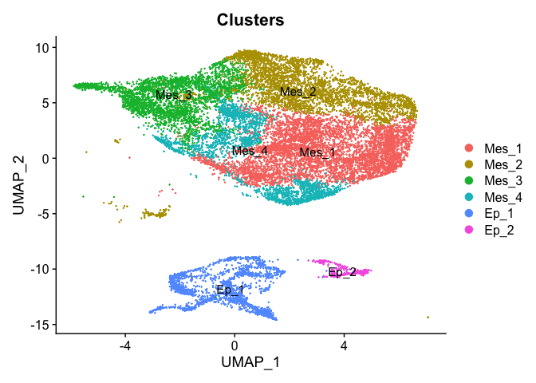<!-- -->

# Create CellChat

``` r
DefaultAssay(WT.subset) <- "SCT"

meta_WT = WT.subset@meta.data
meta_WT$Clusters <- droplevels(meta_WT$Clusters, exclude = c("Prolif_1", "Prolif_2", "Prolif_3", "Imm", "Schw", "End"))


cellchat_WT <- createCellChat(object = WT.subset, meta = meta_WT, group.by = "Clusters")
```

    ## Create a CellChat object from a Seurat object

    ## Set cell identities for the new CellChat object

# Set ligand-receptor database

``` r
CellChatDB <- CellChatDB.mouse 
showDatabaseCategory(CellChatDB)
```

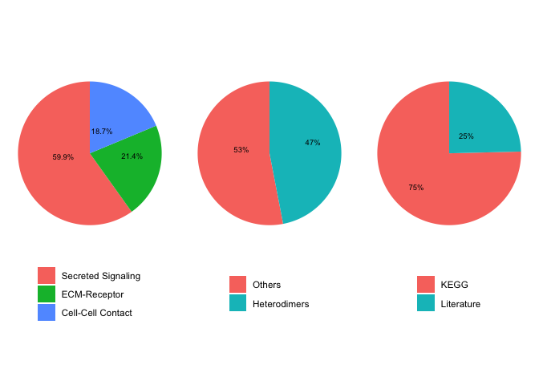<!-- -->

``` r
dplyr::glimpse(CellChatDB$interaction)
```

    ## Rows: 2,019
    ## Columns: 11
    ## $ interaction_name   <chr> "TGFB1_TGFBR1_TGFBR2", "TGFB2_TGFBR1_TGFBR2", "TGFB…
    ## $ pathway_name       <chr> "TGFb", "TGFb", "TGFb", "TGFb", "TGFb", "TGFb", "TG…
    ## $ ligand             <chr> "Tgfb1", "Tgfb2", "Tgfb3", "Tgfb1", "Tgfb1", "Tgfb2…
    ## $ receptor           <chr> "TGFbR1_R2", "TGFbR1_R2", "TGFbR1_R2", "ACVR1B_TGFb…
    ## $ agonist            <chr> "TGFb agonist", "TGFb agonist", "TGFb agonist", "TG…
    ## $ antagonist         <chr> "TGFb antagonist", "TGFb antagonist", "TGFb antagon…
    ## $ co_A_receptor      <chr> "", "", "", "", "", "", "", "", "", "", "", "", "",…
    ## $ co_I_receptor      <chr> "TGFb inhibition receptor", "TGFb inhibition recept…
    ## $ evidence           <chr> "KEGG: mmu04350", "KEGG: mmu04350", "KEGG: mmu04350…
    ## $ annotation         <chr> "Secreted Signaling", "Secreted Signaling", "Secret…
    ## $ interaction_name_2 <chr> "Tgfb1 - (Tgfbr1+Tgfbr2)", "Tgfb2  - (Tgfbr1+Tgfbr2…

``` r
cellchat_WT@DB <- CellChatDB
```

# Preprocessing expression data for cell-cell communication analysis

    ## Issue identified!! Please check the official Gene Symbol of the following genes:  
    ##  H2-BI H2-Ea-ps

# Inference of cell-cell communication network

``` r
cellchat_WT <- computeCommunProb(cellchat_WT)
# Filter out the cell-cell communication if there are only few number of cells in certain cell groups
cellchat_WT <- filterCommunication(cellchat_WT, min.cells = 10)
```

# Infer the cell-cell communication at a signaling pathway level

``` r
cellchat_WT <- computeCommunProbPathway(cellchat_WT)
```

# Calculate the aggregated cell-cell communication network

``` r
cellchat_WT <- aggregateNet(cellchat_WT)
```

``` r
#saveRDS(cellchat_WT, file = "RDSfiles/cellchat_WT_E13.5_Palate.RDS")
```

# CirclePlots of Number and strength of interactions

``` r
groupSize <- as.numeric(table(cellchat_WT@idents))
par(mfrow = c(1,2), xpd=TRUE)
netVisual_circle(cellchat_WT@net$count, vertex.weight = groupSize, weight.scale = T, label.edge= F, title.name = "Number of interactions")
netVisual_circle(cellchat_WT@net$weight, vertex.weight = groupSize, weight.scale = T, label.edge= F, title.name = "Interaction weights/strength")
```

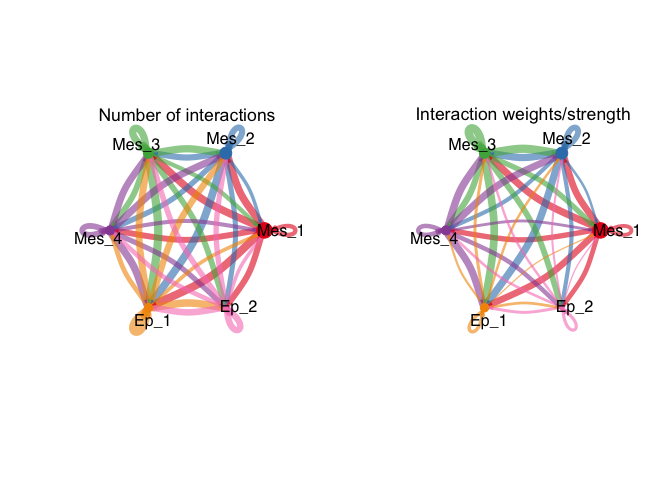<!-- -->

# CirclePlot of interaction weights split by cluster

``` r
mat_WT <- cellchat_WT@net$weight
par(mfrow = c(5,4), xpd=TRUE)
for (i in 1:nrow(mat_WT)) {
  mat2_WT <- matrix(0, nrow = nrow(mat_WT), ncol = ncol(mat_WT), dimnames = dimnames(mat_WT))
  mat2_WT[i, ] <- mat_WT[i, ]
  netVisual_circle(mat2_WT, vertex.weight = groupSize, weight.scale = T, edge.weight.max = max(mat_WT), title.name = rownames(mat_WT)[i])
}
```

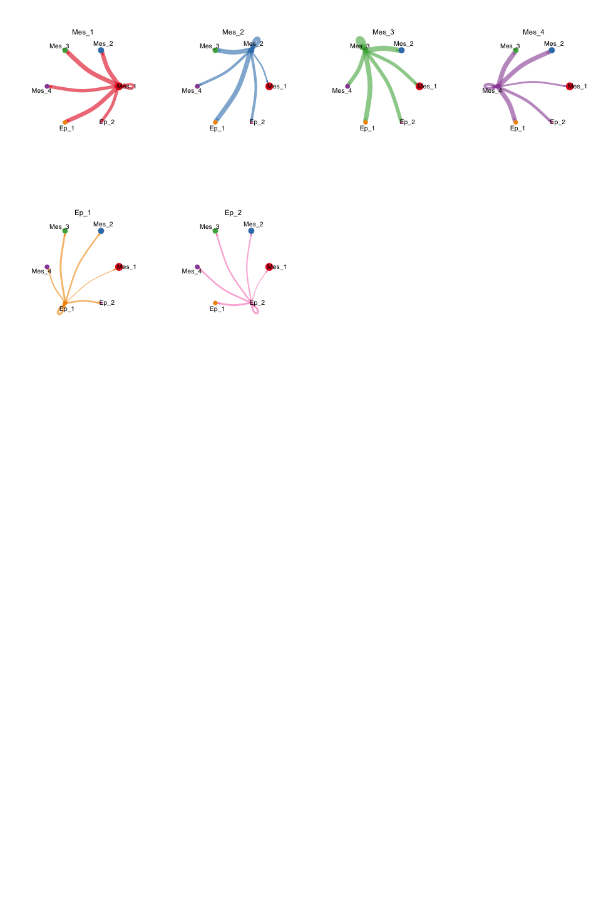<!-- -->

``` r
library(NMF)
```

    ## Loading required package: registry

    ## Loading required package: rngtools

    ## Loading required package: cluster

    ## NMF - BioConductor layer [OK] | Shared memory capabilities [NO: bigmemory] | Cores 9/10

    ##   To enable shared memory capabilities, try: install.extras('
    ## NMF
    ## ')

    ## 
    ## Attaching package: 'NMF'

    ## The following objects are masked from 'package:igraph':
    ## 
    ##     algorithm, compare

``` r
library(ggalluvial)
```

# Identify and visualie outgoing communication pattern of secreting cells

``` r
selectK(cellchat_WT, pattern = "outgoing")
```

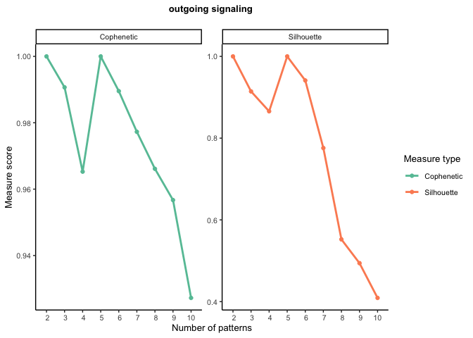<!-- -->

# Visualize three Outgoing Communication Patterns based on selectK results

``` r
nPatterns = 3
cellchat_WT <- identifyCommunicationPatterns(cellchat_WT, pattern = "outgoing", k = nPatterns, height = 12, font.size = 7)
```

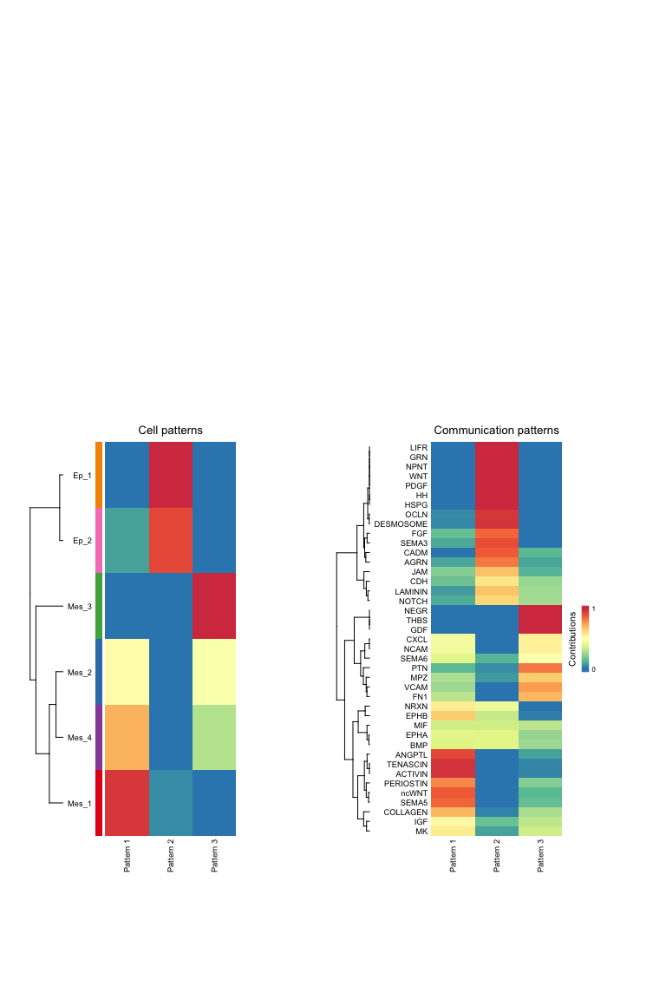<!-- -->

## river plot

``` r
netAnalysis_river(cellchat_WT, pattern = "outgoing")
```

    ## Please make sure you have load `library(ggalluvial)` when running this function

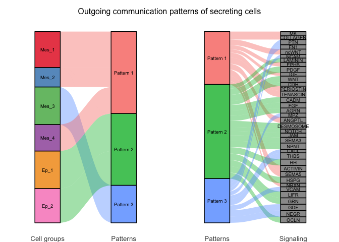<!-- -->

## dot plot

``` r
netAnalysis_dot(cellchat_WT, pattern = "outgoing", dot.size = c(10), font.size = 30, font.size.title = 30)
```

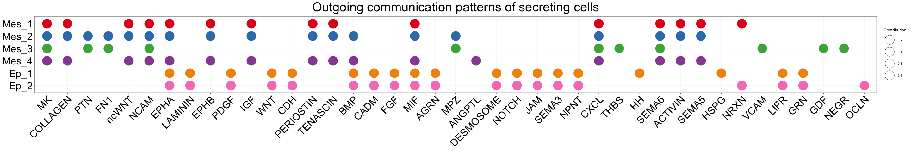<!-- -->

# Identify and visualie incoming communication pattern of secreting cells

``` r
selectK(cellchat_WT, pattern = "incoming")
```

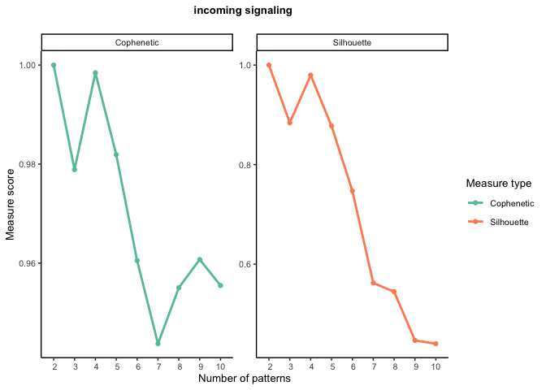<!-- -->

# Visualize four Outgoing Communication Patterns based on selectK results

``` r
nPatterns = 4
cellchat_WT <- identifyCommunicationPatterns(cellchat_WT, pattern = "incoming", k = nPatterns, height = 12, font.size = 7)
```

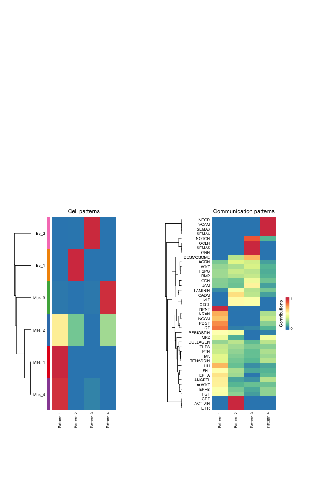<!-- -->

## river plot

``` r
nPatterns = 4
netAnalysis_river(cellchat_WT, pattern = "incoming")
```

    ## Please make sure you have load `library(ggalluvial)` when running this function

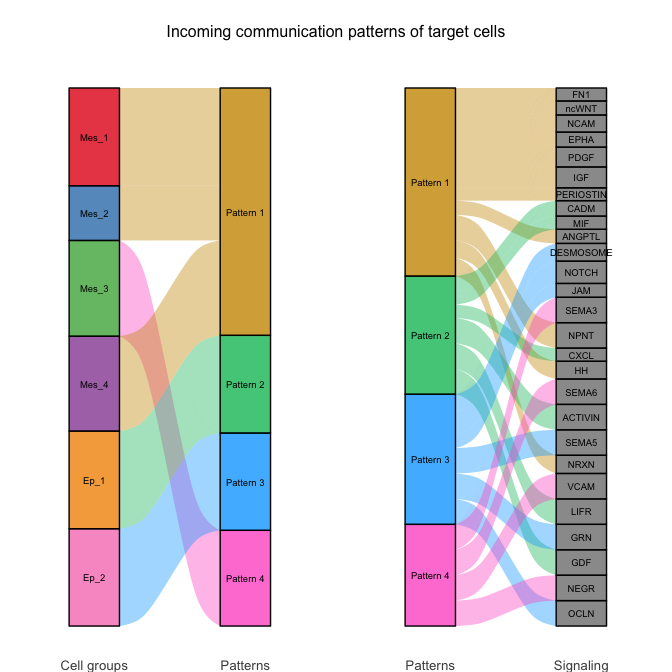<!-- -->

## dot plot

``` r
netAnalysis_dot(cellchat_WT, pattern = "incoming", dot.size = c(10), font.size = 30, font.size.title = 30)
```

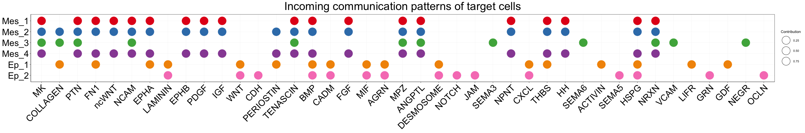<!-- -->

``` r
sessionInfo()
```

    ## R version 4.2.2 (2022-10-31)
    ## Platform: aarch64-apple-darwin20 (64-bit)
    ## Running under: macOS Monterey 12.4
    ## 
    ## Matrix products: default
    ## BLAS:   /Library/Frameworks/R.framework/Versions/4.2-arm64/Resources/lib/libRblas.0.dylib
    ## LAPACK: /Library/Frameworks/R.framework/Versions/4.2-arm64/Resources/lib/libRlapack.dylib
    ## 
    ## locale:
    ## [1] en_US.UTF-8/en_US.UTF-8/en_US.UTF-8/C/en_US.UTF-8/en_US.UTF-8
    ## 
    ## attached base packages:
    ## [1] parallel  stats     graphics  grDevices utils     datasets  methods  
    ## [8] base     
    ## 
    ## other attached packages:
    ##  [1] doParallel_1.0.17   iterators_1.0.14    foreach_1.5.2      
    ##  [4] ggalluvial_0.12.3   NMF_0.25            cluster_2.1.4      
    ##  [7] rngtools_1.5.2      registry_0.5-1      SeuratObject_4.1.3 
    ## [10] Seurat_4.3.0        patchwork_1.1.2     CellChat_1.5.0     
    ## [13] Biobase_2.58.0      BiocGenerics_0.44.0 ggplot2_3.4.0      
    ## [16] igraph_1.3.5        dplyr_1.0.10       
    ## 
    ## loaded via a namespace (and not attached):
    ##   [1] backports_1.4.1        circlize_0.4.15        systemfonts_1.0.4     
    ##   [4] plyr_1.8.8             lazyeval_0.2.2         sp_1.5-1              
    ##   [7] splines_4.2.2          listenv_0.9.0          scattermore_0.8       
    ##  [10] gridBase_0.4-7         digest_0.6.31          htmltools_0.5.4       
    ##  [13] fansi_1.0.3            magrittr_2.0.3         tensor_1.5            
    ##  [16] ROCR_1.0-11            sna_2.7                ComplexHeatmap_2.14.0 
    ##  [19] globals_0.16.2         matrixStats_0.63.0     svglite_2.1.0         
    ##  [22] spatstat.sparse_3.0-0  colorspace_2.0-3       ggrepel_0.9.2         
    ##  [25] xfun_0.36              crayon_1.5.2           jsonlite_1.8.4        
    ##  [28] spatstat.data_3.0-0    progressr_0.12.0       survival_3.4-0        
    ##  [31] zoo_1.8-11             glue_1.6.2             polyclip_1.10-4       
    ##  [34] gtable_0.3.1           leiden_0.4.3           GetoptLong_1.0.5      
    ##  [37] car_3.1-1              future.apply_1.10.0    shape_1.4.6           
    ##  [40] abind_1.4-5            scales_1.2.1           DBI_1.1.3             
    ##  [43] spatstat.random_3.0-1  rstatix_0.7.1          miniUI_0.1.1.1        
    ##  [46] Rcpp_1.0.9             viridisLite_0.4.1      xtable_1.8-4          
    ##  [49] clue_0.3-63            reticulate_1.26        stats4_4.2.2          
    ##  [52] htmlwidgets_1.6.0      httr_1.4.4             FNN_1.1.3.1           
    ##  [55] RColorBrewer_1.1-3     ellipsis_0.3.2         ica_1.0-3             
    ##  [58] farver_2.1.1           pkgconfig_2.0.3        uwot_0.1.14           
    ##  [61] deldir_1.0-6           utf8_1.2.2             labeling_0.4.2        
    ##  [64] tidyselect_1.2.0       rlang_1.0.6            reshape2_1.4.4        
    ##  [67] later_1.3.0            munsell_0.5.0          tools_4.2.2           
    ##  [70] cli_3.5.0              generics_0.1.3         statnet.common_4.7.0  
    ##  [73] broom_1.0.2            ggridges_0.5.4         evaluate_0.19         
    ##  [76] stringr_1.5.0          fastmap_1.1.0          goftest_1.2-3         
    ##  [79] yaml_2.3.6             knitr_1.41             fitdistrplus_1.1-8    
    ##  [82] purrr_1.0.0            RANN_2.6.1             nlme_3.1-161          
    ##  [85] pbapply_1.6-0          future_1.30.0          mime_0.12             
    ##  [88] compiler_4.2.2         rstudioapi_0.14        plotly_4.10.1         
    ##  [91] png_0.1-8              ggsignif_0.6.4         spatstat.utils_3.0-1  
    ##  [94] tibble_3.1.8           stringi_1.7.8          highr_0.10            
    ##  [97] RSpectra_0.16-1        forcats_0.5.2          lattice_0.20-45       
    ## [100] Matrix_1.5-3           vctrs_0.5.1            pillar_1.8.1          
    ## [103] lifecycle_1.0.3        BiocManager_1.30.19    spatstat.geom_3.0-3   
    ## [106] lmtest_0.9-40          GlobalOptions_0.1.2    RcppAnnoy_0.0.20      
    ## [109] data.table_1.14.6      cowplot_1.1.1          irlba_2.3.5.1         
    ## [112] httpuv_1.6.7           R6_2.5.1               promises_1.2.0.1      
    ## [115] network_1.18.0         gridExtra_2.3          KernSmooth_2.23-20    
    ## [118] IRanges_2.32.0         parallelly_1.33.0      codetools_0.2-18      
    ## [121] MASS_7.3-58.1          assertthat_0.2.1       rjson_0.2.21          
    ## [124] withr_2.5.0            sctransform_0.3.5      S4Vectors_0.36.1      
    ## [127] grid_4.2.2             tidyr_1.2.1            coda_0.19-4           
    ## [130] rmarkdown_2.19         carData_3.0-5          Cairo_1.6-0           
    ## [133] Rtsne_0.16             ggpubr_0.5.0           spatstat.explore_3.0-5
    ## [136] shiny_1.7.4
