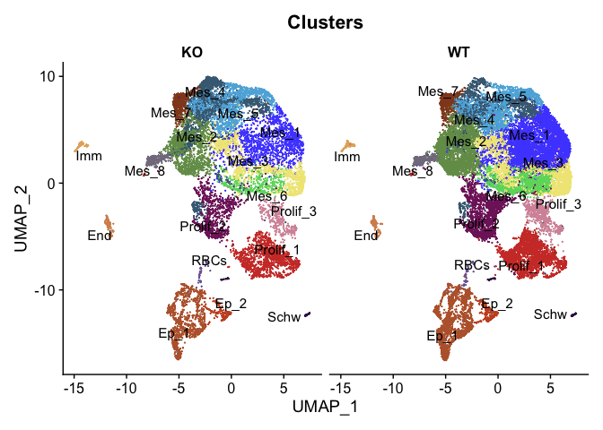
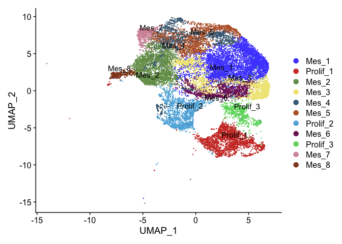
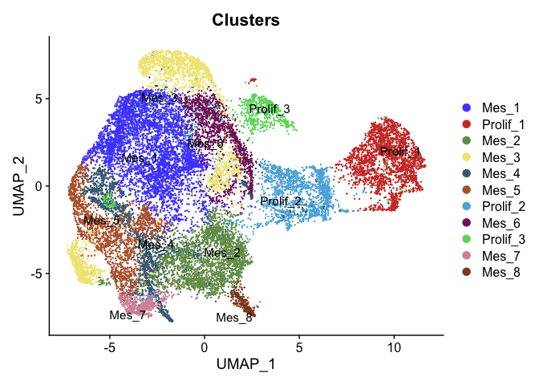
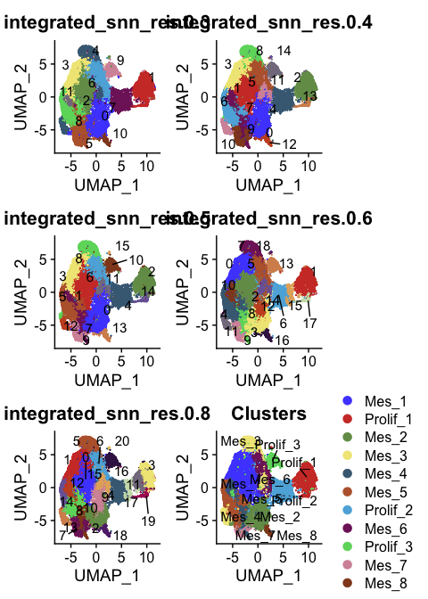
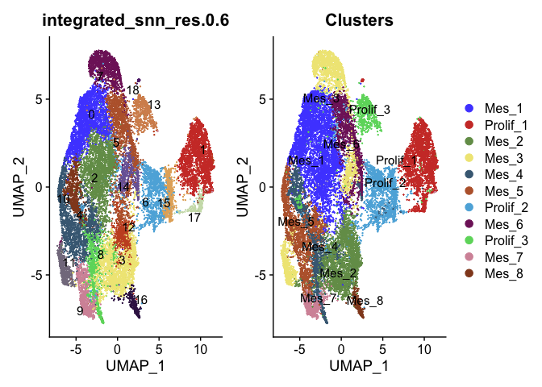
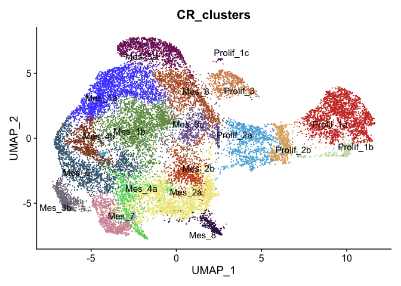

CellRank processing R Notebook
================

# 1. libraries

``` r
suppressPackageStartupMessages({
  library(Seurat)
  library(dplyr)
  library(ggplot2)
  library(ggsci)
  library(patchwork)
  library(SeuratDisk)
})
options(future.globals.maxSize = 6000 * 1024^2)
mem.maxVSize(vsize = 32000000000)
```

# 2. Read data

``` r
int5 <- readRDS("RDSfiles/int5.clustered.RDS")
```

``` r
DimPlot(int5, label = T, repel = T, split.by = "KO_type", group.by = "Clusters") + scale_color_igv() + NoLegend()
```

<!-- -->

# 3. Subset WT only Mes clusters

``` r
Idents(int5) <- "KO_type"
WTonly <- subset(int5, idents = "WT")
Idents(WTonly) <- "Clusters"
WT_mes <- subset(WTonly, idents = c("Mes_1","Mes_2","Mes_3","Mes_4","Mes_5","Mes_6","Mes_7","Mes_8","Prolif_1","Prolif_2","Prolif_3"))
DimPlot(WT_mes, label = T, repel = T) + scale_color_igv()
```

<!-- -->
# 4. Clean UMAP and clusters

``` r
DefaultAssay(WT_mes) <- "integrated"
WT_mes <- RunUMAP(WT_mes, dims = 1:50)
```

    ## Warning: The default method for RunUMAP has changed from calling Python UMAP via reticulate to the R-native UWOT using the cosine metric
    ## To use Python UMAP via reticulate, set umap.method to 'umap-learn' and metric to 'correlation'
    ## This message will be shown once per session

    ## 14:09:19 UMAP embedding parameters a = 0.9922 b = 1.112

    ## 14:09:19 Read 19376 rows and found 50 numeric columns

    ## 14:09:19 Using Annoy for neighbor search, n_neighbors = 30

    ## 14:09:19 Building Annoy index with metric = cosine, n_trees = 50

    ## 0%   10   20   30   40   50   60   70   80   90   100%

    ## [----|----|----|----|----|----|----|----|----|----|

    ## **************************************************|
    ## 14:09:20 Writing NN index file to temp file /var/folders/5l/4z632ppn6k795v72dh_jd98m0000gn/T//RtmpKZadq7/file706f35bc535a
    ## 14:09:20 Searching Annoy index using 1 thread, search_k = 3000
    ## 14:09:23 Annoy recall = 100%
    ## 14:09:24 Commencing smooth kNN distance calibration using 1 thread with target n_neighbors = 30
    ## 14:09:24 Initializing from normalized Laplacian + noise (using irlba)
    ## 14:09:24 Commencing optimization for 200 epochs, with 817604 positive edges
    ## 14:09:33 Optimization finished

``` r
DimPlot(WT_mes, label = T, repel = T, group.by = "Clusters") + scale_color_igv()
```

<!-- -->

``` r
WT_mes <- FindNeighbors(WT_mes, dims = 1:50)
```

    ## Computing nearest neighbor graph

    ## Computing SNN

``` r
WT_mes <- FindClusters(WT_mes, resolution = 0.3)
```

    ## Modularity Optimizer version 1.3.0 by Ludo Waltman and Nees Jan van Eck
    ## 
    ## Number of nodes: 19376
    ## Number of edges: 769520
    ## 
    ## Running Louvain algorithm...
    ## Maximum modularity in 10 random starts: 0.9149
    ## Number of communities: 12
    ## Elapsed time: 2 seconds

``` r
WT_mes <- FindClusters(WT_mes, resolution = 0.4)
```

    ## Modularity Optimizer version 1.3.0 by Ludo Waltman and Nees Jan van Eck
    ## 
    ## Number of nodes: 19376
    ## Number of edges: 769520
    ## 
    ## Running Louvain algorithm...
    ## Maximum modularity in 10 random starts: 0.9057
    ## Number of communities: 15
    ## Elapsed time: 2 seconds

``` r
WT_mes <- FindClusters(WT_mes, resolution = 0.5)
```

    ## Modularity Optimizer version 1.3.0 by Ludo Waltman and Nees Jan van Eck
    ## 
    ## Number of nodes: 19376
    ## Number of edges: 769520
    ## 
    ## Running Louvain algorithm...
    ## Maximum modularity in 10 random starts: 0.8964
    ## Number of communities: 16
    ## Elapsed time: 2 seconds

``` r
WT_mes <- FindClusters(WT_mes, resolution = 0.6)
```

    ## Modularity Optimizer version 1.3.0 by Ludo Waltman and Nees Jan van Eck
    ## 
    ## Number of nodes: 19376
    ## Number of edges: 769520
    ## 
    ## Running Louvain algorithm...
    ## Maximum modularity in 10 random starts: 0.8888
    ## Number of communities: 19
    ## Elapsed time: 2 seconds

``` r
WT_mes <- FindClusters(WT_mes, resolution = 0.8)
```

    ## Modularity Optimizer version 1.3.0 by Ludo Waltman and Nees Jan van Eck
    ## 
    ## Number of nodes: 19376
    ## Number of edges: 769520
    ## 
    ## Running Louvain algorithm...
    ## Maximum modularity in 10 random starts: 0.8749
    ## Number of communities: 21
    ## Elapsed time: 2 seconds

``` r
p1 <- DimPlot(WT_mes, label = T, repel = T, group.by = "integrated_snn_res.0.3") + scale_color_igv() + NoLegend()
p2 <- DimPlot(WT_mes, label = T, repel = T, group.by = "integrated_snn_res.0.4") + scale_color_igv() + NoLegend()
p3 <- DimPlot(WT_mes, label = T, repel = T, group.by = "integrated_snn_res.0.5") + scale_color_igv() + NoLegend()
p4 <- DimPlot(WT_mes, label = T, repel = T, group.by = "integrated_snn_res.0.6") + scale_color_igv() + NoLegend()
p5 <- DimPlot(WT_mes, label = T, repel = T, group.by = "integrated_snn_res.0.8") + scale_color_igv() + NoLegend()
p6 <- DimPlot(WT_mes, label = T, repel = T, group.by = "Clusters") + scale_color_igv()
p1 + p2 + p3 + p4 + p5 + p6 + plot_layout(ncol = 2)
```

<!-- -->

Don’t want to have some clusters spread out over UMAP (like Mes_3 and
Mes_4), so will use resolution 0.6 for cellrank analysis Will rename
split clusters a,b,c etc…

``` r
p4 + p6
```

<!-- -->

# 4.1 Rename clusters

``` r
Idents(WT_mes) <- "integrated_snn_res.0.6"
WT_mes <- RenameIdents(WT_mes,
                       "0" = "Mes_1a",
                       "1" = "Prolif_1a",
                       "2" = "Mes_1b",
                       "3" = "Mes_2a",
                       "4" = "Mes_5",
                       "5" = "Mes_6",
                       "6" = "Prolif_2a",
                       "7" = "Mes_3a",
                       "8" = "Mes_4a",
                       "9" = "Mes_7",
                       "10" = "Mes_4b",
                       "11" = "Mes_3b",
                       "12" = "Mes_2b",
                       "13" = "Prolif_3",
                       "14" = "Mes_3c",
                       "15" = "Prolif_2b",
                       "16" = "Mes_8",
                       "17" = "Prolif_1b",
                       "18" = "Prolif_1c")
WT_mes$CR_clusters <- Idents(WT_mes)
DimPlot(WT_mes, group.by = "CR_clusters", label = T, repel = T) +scale_color_igv() + NoLegend()
```

<!-- -->

``` r
saveRDS(WT_mes, file = "RDSfiles/int.WT.mes.RDS")
```

``` r
#WT_mes <- readRDS(file = "RDSfiles/int.WT.mes.RDS")
```

## Convert Seurat object to anndata

Note that data from RNA is unnormalized raw counts which is being added
as X to h5ad file

``` r
# WT_mes <- UpdateSeuratObject(WT_mes)
# WT_mes <- UpdateSCTAssays(WT_mes)
# WT_mes[['integrated']] <- as(object = WT_mes[['integrated']] , Class = "SCTAssay")
# slot(WT_mes$SCT@SCTModel.list[[1]], 'median_umi') = median(WT_mes$SCT@SCTModel.list[[1]]@cell.attributes$umi)
```

Final solution was to go to:
<https://github.com/mojaveazure/seurat-disk/tree/95d27f636e719cf5fa49b02b05876354343138cd>
and download zip file. Then install with:

devtools::install(“\~/Downloads/seurat-disk-95d27f636e719cf5fa49b02b05876354343138cd/”)

this actually installs older version of seurat-disk. When tried to
install older version with:
remotes::install_github(“<mojaveazure/seurat-disk@95d27f6>”)

It seems to install an older version, the sessionInfo says it’s an older
version but the behavior is the same as current version: looks for slot
median_umi in SCTModel.

``` r
DefaultAssay(WT_mes) <- "RNA"
#SaveH5Seurat(WT_mes, filename = "RDSfiles/int.WT.mes.h5Seurat") ## this gave error: no slot of name "median_umi" for this object of class "SCTModel", so since using RNA assay for cellrank will remove SCT assay and integrated assay which were both necessary to remove to prevent this error
WT_mes@assays$SCT <- NULL
WT_mes@assays$integrated <- NULL  
#The problem here is that although it generated the h5ad object, the object had no X-umap because that's associated with the "integrated" assay
SaveH5Seurat(WT_mes, filename = "RDSfiles/int.WT.mes.h5Seurat")
```

    ## Creating h5Seurat file for version 3.1.5.9900

    ## Adding counts for RNA

    ## Adding data for RNA

    ## No variable features found for RNA

    ## No feature-level metadata found for RNA

    ## Adding cell embeddings for pca

    ## Adding loadings for pca

    ## No projected loadings for pca

    ## Adding standard deviations for pca

    ## No JackStraw data for pca

    ## Adding cell embeddings for umap

    ## No loadings for umap

    ## No projected loadings for umap

    ## No standard deviations for umap

    ## No JackStraw data for umap

``` r
Convert("RDSfiles/int.WT.mes.h5Seurat", dest = "h5ad")
```

    ## Validating h5Seurat file

    ## Warning: Cannot find assay integrated in the H5Seurat file

    ## Warning: Cannot find assay integrated in the H5Seurat file

    ## Warning: Cannot find assay integrated in the h5Seurat file

    ## Warning: Cannot find assay integrated in the h5Seurat file

    ## Warning: Cannot find assayintegrated in the h5Seurat file

    ## Warning: Cannot find assaySCT in the h5Seurat file

    ## Warning: Cannot find assayintegrated in the h5Seurat file

    ## Warning: Cannot find assayintegrated in the h5Seurat file

    ## Warning: Cannot find assayintegrated in the h5Seurat file

    ## Adding data from RNA as X

    ## Adding counts from RNA as raw

    ## Transfering meta.data to obs

``` r
sessionInfo()
```

    ## R version 4.2.2 (2022-10-31)
    ## Platform: aarch64-apple-darwin20 (64-bit)
    ## Running under: macOS Monterey 12.4
    ## 
    ## Matrix products: default
    ## BLAS:   /Library/Frameworks/R.framework/Versions/4.2-arm64/Resources/lib/libRblas.0.dylib
    ## LAPACK: /Library/Frameworks/R.framework/Versions/4.2-arm64/Resources/lib/libRlapack.dylib
    ## 
    ## locale:
    ## [1] en_US.UTF-8/en_US.UTF-8/en_US.UTF-8/C/en_US.UTF-8/en_US.UTF-8
    ## 
    ## attached base packages:
    ## [1] stats     graphics  grDevices utils     datasets  methods   base     
    ## 
    ## other attached packages:
    ## [1] SeuratDisk_0.0.0.9020 patchwork_1.1.2       ggsci_2.9            
    ## [4] ggplot2_3.4.0         dplyr_1.0.10          SeuratObject_4.1.3   
    ## [7] Seurat_4.3.0         
    ## 
    ## loaded via a namespace (and not attached):
    ##   [1] Rtsne_0.16             colorspace_2.0-3       deldir_1.0-6          
    ##   [4] ellipsis_0.3.2         ggridges_0.5.4         rstudioapi_0.14       
    ##   [7] spatstat.data_3.0-0    farver_2.1.1           leiden_0.4.3          
    ##  [10] listenv_0.9.0          bit64_4.0.5            ggrepel_0.9.2         
    ##  [13] fansi_1.0.3            codetools_0.2-18       splines_4.2.2         
    ##  [16] knitr_1.41             polyclip_1.10-4        jsonlite_1.8.4        
    ##  [19] ica_1.0-3              cluster_2.1.4          png_0.1-8             
    ##  [22] uwot_0.1.14            shiny_1.7.4            sctransform_0.3.5     
    ##  [25] spatstat.sparse_3.0-0  compiler_4.2.2         httr_1.4.4            
    ##  [28] assertthat_0.2.1       Matrix_1.5-3           fastmap_1.1.0         
    ##  [31] lazyeval_0.2.2         cli_3.5.0              later_1.3.0           
    ##  [34] htmltools_0.5.4        tools_4.2.2            igraph_1.3.5          
    ##  [37] gtable_0.3.1           glue_1.6.2             RANN_2.6.1            
    ##  [40] reshape2_1.4.4         Rcpp_1.0.9             scattermore_0.8       
    ##  [43] vctrs_0.5.1            nlme_3.1-161           spatstat.explore_3.0-5
    ##  [46] progressr_0.12.0       lmtest_0.9-40          spatstat.random_3.0-1 
    ##  [49] xfun_0.36              stringr_1.5.0          globals_0.16.2        
    ##  [52] mime_0.12              miniUI_0.1.1.1         lifecycle_1.0.3       
    ##  [55] irlba_2.3.5.1          goftest_1.2-3          future_1.30.0         
    ##  [58] MASS_7.3-58.1          zoo_1.8-11             scales_1.2.1          
    ##  [61] promises_1.2.0.1       spatstat.utils_3.0-1   parallel_4.2.2        
    ##  [64] RColorBrewer_1.1-3     yaml_2.3.6             reticulate_1.26       
    ##  [67] pbapply_1.6-0          gridExtra_2.3          stringi_1.7.8         
    ##  [70] highr_0.10             rlang_1.0.6            pkgconfig_2.0.3       
    ##  [73] matrixStats_0.63.0     evaluate_0.19          lattice_0.20-45       
    ##  [76] ROCR_1.0-11            purrr_1.0.0            tensor_1.5            
    ##  [79] labeling_0.4.2         htmlwidgets_1.6.0      bit_4.0.5             
    ##  [82] cowplot_1.1.1          tidyselect_1.2.0       parallelly_1.33.0     
    ##  [85] RcppAnnoy_0.0.20       plyr_1.8.8             magrittr_2.0.3        
    ##  [88] R6_2.5.1               generics_0.1.3         DBI_1.1.3             
    ##  [91] withr_2.5.0            pillar_1.8.1           fitdistrplus_1.1-8    
    ##  [94] survival_3.4-0         abind_1.4-5            sp_1.5-1              
    ##  [97] tibble_3.1.8           future.apply_1.10.0    hdf5r_1.3.7           
    ## [100] crayon_1.5.2           KernSmooth_2.23-20     utf8_1.2.2            
    ## [103] spatstat.geom_3.0-3    plotly_4.10.1          rmarkdown_2.19        
    ## [106] grid_4.2.2             data.table_1.14.6      digest_0.6.31         
    ## [109] xtable_1.8-4           tidyr_1.2.1            httpuv_1.6.7          
    ## [112] munsell_0.5.0          viridisLite_0.4.1
