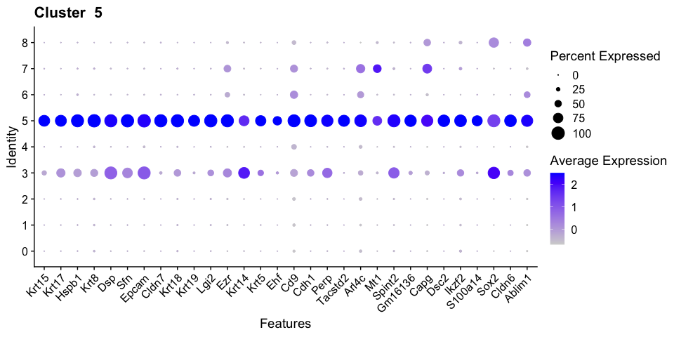
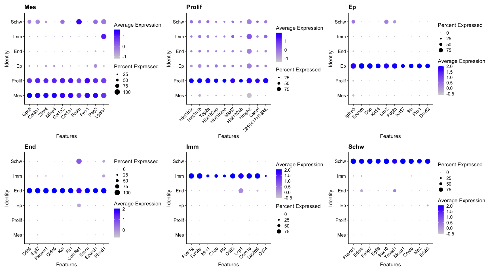

Cluster Analysis of WT1, WT2, WT3 integrated single cell RNAseq R
Notebook
================

<style type="text/css">
caption {
      color: blue;
      font-weight: bold;
      font-size: 2.0em;
    }
</style>

``` r
library(Seurat)
library(devtools)
library(sctransform)
library(ggplot2)
library(dplyr)
library(ggsci)
library(cowplot)
library(patchwork)
library(multtest)
library(ComplexHeatmap)
library(tictoc)
library(topGO)
library(Matrix)
library(Scillus)
library(clusterProfiler)
library(knitr)
library(tidyr)
options(future.globals.maxSize = 4000 * 1024^2)
```

``` r
mypal <- pal_igv(palette = "default",alpha = 1)(30)
mem.maxVSize(vsize = 32000000000)
```

# Read Data

``` r
int.seurat <- readRDS(file = "RDSfiles/int3.clustered.RDS")
```

# UMAP of Clusters to be Identified

``` r
DimPlot(int.seurat, group.by = "integrated_snn_res.0.1", label = T, repel = T) + scale_color_igv()
```

<!-- -->

``` r
DimPlot(int.seurat, group.by = "integrated_snn_res.0.2", label = T, repel = T) + scale_color_igv()
```

<!-- -->

``` r
DefaultAssay(int.seurat) <- "SCT"
```

# Cluster Naming

``` r
Idents(int.seurat) <- "integrated_snn_res.0.2"
int.seurat <- RenameIdents(int.seurat,
                           "0" = "Mes_1",
                           "1" = "Mes_2",
                           "2" = "Mes_3",
                           "3" = "Mes_4",
                           "4" = "Prolif_2",
                           "5" = "Ep_1",
                           "6" = "Prolif_1",
                           "7" = "Prolif_3",
                           "8" = "Ep_2",
                           "9" = "End",
                           "10" = "Imm",
                           "11" = "Schw")
int.seurat$Clusters <- Idents(int.seurat)
DimPlot(int.seurat, group.by = "Clusters", label = T, repel = T) + scale_color_igv()
```

<!-- -->

``` r
DefaultAssay(int.seurat) <- "SCT"
```

# Cluster Marker Genes

# Find all markers at 0.1 snn

``` r
Idents(int.seurat) <- "integrated_snn_res.0.1"
DefaultAssay(int.seurat) <- "SCT"
All.markers <- FindAllMarkers(int.seurat, only.pos = TRUE, recorrect_umi=FALSE)
```

    ## Calculating cluster 0

    ## Calculating cluster 1

    ## Calculating cluster 2

    ## Calculating cluster 3

    ## Calculating cluster 4

    ## Calculating cluster 5

    ## Calculating cluster 6

    ## Calculating cluster 7

    ## Calculating cluster 8

``` r
#All.markers <-readRDS(file = "RDSfiles/All.markers.int3.1.RDS")

top10 <- All.markers %>% group_by(cluster) %>% top_n(n=-10, wt = p_val) %>% top_n(n=10, wt = avg_log2FC)
top10
top20 <- All.markers %>% group_by(cluster) %>% top_n(n=-20, wt = p_val) %>% top_n(n=20, wt = avg_log2FC)
top30 <- All.markers %>% group_by(cluster) %>% top_n(n=-30, wt = p_val) %>% top_n(n=30, wt = avg_log2FC)
```

``` r
#write.table(All.markers, file = "MarkersandPlots/All.markers.int3.snn.0.1.txt", sep = "\t", quote = F, col.names = NA)
```

``` r
#saveRDS(All.markers, file = "RDSfiles/All.markers.int3.snn.0.1.RDS")
```

# Find all markers at 0.2 snn resolution

``` r
Idents(int.seurat) <- "Clusters"
DefaultAssay(int.seurat) <- "SCT"
All.markers2 <- FindAllMarkers(int.seurat, only.pos = TRUE, recorrect_umi=FALSE)
```

    ## Calculating cluster Mes_1

    ## Calculating cluster Mes_2

    ## Calculating cluster Mes_3

    ## Calculating cluster Mes_4

    ## Calculating cluster Prolif_2

    ## Calculating cluster Ep_1

    ## Calculating cluster Prolif_1

    ## Calculating cluster Prolif_3

    ## Calculating cluster Ep_2

    ## Calculating cluster End

    ## Calculating cluster Imm

    ## Calculating cluster Schw

``` r
#All.markers2 <-readRDS(file = "RDSfiles/All.markers.int3.2.RDS")

top10.2 <- All.markers2 %>% group_by(cluster) %>% top_n(n=-10, wt = p_val) %>% top_n(n=10, wt = avg_log2FC)
top10.2
top15.2 <- All.markers2 %>% group_by(cluster) %>% top_n(n=-15, wt = p_val) %>% top_n(n=15, wt = avg_log2FC)
top20.2 <- All.markers2 %>% group_by(cluster) %>% top_n(n=-20, wt = p_val) %>% top_n(n=20, wt = avg_log2FC)
top30.2 <- All.markers2 %>% group_by(cluster) %>% top_n(n=-30, wt = p_val) %>% top_n(n=30, wt = avg_log2FC)
```

``` r
#write.table(All.markers2, file = "MarkersandPlots/All.markers.int3.snn.0.1.txt", sep = "\t", quote = F, col.names = NA)
```

``` r
#saveRDS(All.markers2, file = "RDSfiles/All.markers.int3.snn.0.2.RDS")
```

### Top10 genes dotPlots 0.1res

``` r
Idents(int.seurat) <- "integrated_snn_res.0.1"
top10_dotplots <- list()
for(cluster in levels(int.seurat)){
  top10_dotplots[[cluster]] <- DotPlot(int.seurat, features = top10$gene[top10$cluster == cluster]) + RotatedAxis() + ggtitle(paste("Cluster ",cluster))
}
wrap_plots(top10_dotplots, ncol = 4)
```

<!-- -->

### Top30 genes dotPlots 0.1res

These are simple the top30 rather than top10 genes and each cluster plot
printed individually so the genes are clearly readable.

``` r
Idents(int.seurat) <- "integrated_snn_res.0.1"
DimPlot(int.seurat, group.by = "integrated_snn_res.0.1", label = T, repel = T) + scale_color_igv()
```

<!-- -->

``` r
for(cluster in levels(int.seurat)){
  p <- DotPlot(int.seurat, features = top30$gene[top30$cluster == cluster]) + RotatedAxis() + ggtitle(paste("Cluster ",cluster))
  print(p)
}
```

<!-- --><!-- --><!-- --><!-- --><!-- --><!-- --><!-- --><!-- --><!-- -->

### Top10 genes dotPlots 0.2res

``` r
Idents(int.seurat) <- "Clusters"
levels(int.seurat) <- c("Prolif_1", "Prolif_2", "Prolif_3", "Ep_1", "Ep_2", "Mes_1", "Mes_2", "Mes_3", "Mes_4", "End", "Imm", "Schw")
top10_dotplots.2 <- list()
for(cluster in levels(int.seurat)){
  top10_dotplots.2[[cluster]] <- DotPlot(int.seurat, features = top10.2$gene[top10.2$cluster == cluster]) + RotatedAxis() + ggtitle(paste(cluster))
}
wrap_plots(top10_dotplots.2, ncol = 3)
```

<!-- -->

### Top15 genes dotPlots 0.2res

``` r
Idents(int.seurat) <- "Clusters"
levels(int.seurat) <- c("Prolif_1", "Prolif_2", "Prolif_3", "Ep_1", "Ep_2", "Mes_1", "Mes_2", "Mes_3", "Mes_4", "End", "Imm", "Schw")
top15_dotplots.2 <- list()
for(cluster in levels(int.seurat)){
  top15_dotplots.2[[cluster]] <- DotPlot(int.seurat, features = top15.2$gene[top15.2$cluster == cluster]) + RotatedAxis() + ggtitle(paste(cluster))
}
wrap_plots(top15_dotplots.2, ncol = 3)
```

<!-- -->

### Top20 genes dotPlots 0.2res

``` r
Idents(int.seurat) <- "Clusters"
levels(int.seurat) <- c("Prolif_1", "Prolif_2", "Prolif_3", "Ep_1", "Ep_2", "Mes_1", "Mes_2", "Mes_3", "Mes_4", "End", "Imm", "Schw")
top20_dotplots.2 <- list()
for(cluster in levels(int.seurat)){
  top20_dotplots.2[[cluster]] <- DotPlot(int.seurat, features = top20.2$gene[top20.2$cluster == cluster]) + RotatedAxis() + ggtitle(paste(cluster))
}
wrap_plots(top20_dotplots.2, ncol = 3)
```

<!-- -->

### Top30 genes dotPlots 0.2res

Top30 genes with each cluster plot printed individually so the genes are
clearly readable.

``` r
Idents(int.seurat) <- "Clusters"
DimPlot(int.seurat, group.by = "Clusters", label = T, repel = T) + scale_color_igv()
```

<!-- -->

``` r
for(cluster in levels(int.seurat)){
  p <- DotPlot(int.seurat, features = top30.2$gene[top30.2$cluster == cluster]) + RotatedAxis() + ggtitle(paste(cluster))
  print(p)
}
```

<!-- --><!-- --><!-- --><!-- --><!-- --><!-- --><!-- --><!-- --><!-- --><!-- --><!-- --><!-- -->

#HeatMap, each row is a gene each column is a single cell

``` r
levels(int.seurat) <- c("Mes_1", "Mes_2", "Mes_3", "Mes_4", "Prolif_1", "Prolif_2", "Prolif_3",  "Ep_1", "Ep_2", "End", "Imm", "Schw")
DoHeatmap(int.seurat, features = top10.2$gene, size = 15, lines.width = 100) + theme(text = element_text(size = 60))
```

<!-- -->

#Determine Cell Proportionality and Replicate Distribution
<!-- -->

    ## # A tibble: 3 × 13
    ##   Var2  Mes_1 Mes_2 Mes_3 Mes_4 Prolif_2  Ep_1 Proli…¹ Proli…²  Ep_2   End   Imm
    ##   <fct> <dbl> <dbl> <dbl> <dbl>    <dbl> <dbl>   <dbl>   <dbl> <dbl> <dbl> <dbl>
    ## 1 WT_1   21.2  13.8  16.8 11.4      11.3 10.7     8.02    2.42 2.14  1.07  0.678
    ## 2 WT_2   28.2  17.0  13.6  9.19     10.2  7.91    8.61    2.75 0.972 0.858 0.400
    ## 3 WT_3   24.6  20.1  10.4 11.7      10.5 10.1     7.83    2.63 1.03  0.482 0.371
    ## # … with 1 more variable: Schw <dbl>, and abbreviated variable names ¹​Prolif_1,
    ## #   ²​Prolif_3

<!-- -->

    ## quartz_off_screen 
    ##                 2

    ## quartz_off_screen 
    ##                 2

# Marker Gene Plots

## Gene expression UMAPs

## FeaturePlots of Mesenchyme, Proliferating, Epithelial, Endothelial, Immune, and Schwann cell populations

``` r
Idents(int.seurat) <- "Clusters"

levels(int.seurat) <- c("Mes_1", "Mes_2", "Mes_3", "Mes_4", "Prolif_1", "Prolif_2", "Prolif_3", "Ep_1", "Ep_2", "End", "Imm", "Schw")

FeaturePlot(int.seurat, features = c("Col1a2", "Top2a", "Epcam", "Pecam1", "Fcer1g", "Fabp7"), ncol = 3)
```

<!-- -->

## FeaturePlots of Specific markers of subclustered proliferating, epithelial, and mesenchymal populations

``` r
#proliferating 1, 2, and 3
FeaturePlot(int.seurat, features = c("Cenpa", "Hist1h3c", "Ccne2"), ncol = 3) + theme(aspect.ratio = 0.9)
```

<!-- -->

``` r
#ep1 and ep2
FeaturePlot(int.seurat, features = c("Igfbp2", "Trp63", "Cldn7", "Krt18"), ncol = 4) + theme(aspect.ratio = 0.9)
```

<!-- -->

``` r
#mes1, 2, 3, and 4
FeaturePlot(int.seurat, features = c("Osr2", "Runx2", "Ogn", "Epha3"), ncol = 4) + theme(aspect.ratio = 0.9)
```

<!-- --> ##
FeaturePlots of Specific markers of subclustered proliferating,
epithelial, and mesenchymal populations split by embryo of origin

``` r
#proliferating 1, 2, and 3
FeaturePlot(int.seurat, features = c("Cenpa", "Hist1h3c", "Ccne2"), split.by = "orig.ident", ncol = 3)
```

<!-- -->

``` r
#ep1 and ep2
FeaturePlot(int.seurat, features = c("Igfbp2", "Trp63", "Cldn7", "Krt18"), split.by = "orig.ident", ncol = 4) 
```

<!-- -->

``` r
#mes1, 2, 3, and 4
FeaturePlot(int.seurat, features = c("Osr2", "Runx2", "Ogn", "Epha3"), split.by = "orig.ident", ncol = 4)
```

<!-- -->

## FeaturePlot and ViolinPlot of Shox2 and Msx1

``` r
FeaturePlot(int.seurat, features = c("Shox2", "Msx1")) + theme(aspect.ratio = 0.9)
```

<!-- -->

``` r
VlnPlot(int.seurat, features = c("Shox2", "Msx1")) + RotatedAxis()
```

<!-- -->

# DotPlots

## DotPlot of Top2 genes per cluster

``` r
DotPlot(int.seurat, features = c("Osr2", "Shox2", "Runx2", "Msx1", "Ogn", "Mecom", "Epha3", "Egfl6", "Cenpa", "Tubb4b", "Hist1h3c", "Hist1h1b", "Ccne2", "Cdc6", "Igfbp2", "Trp63", "Cldn7", "Krt18", "Pecam1", "Sparcl1", "Fcer1g", "Tyrobp", "Fabp7", "Mpz")) + RotatedAxis()
```

<!-- -->
#DimPlot by Celltype no subclustering

``` r
new.cluster.ids <- c("Mes", "Mes", "Mes", "Mes", "Prolif", "Prolif", "Prolif", "Ep", "Ep", "End", "Imm", "Schw")
names(new.cluster.ids) <- levels(int.seurat)
int.seurat <- RenameIdents(int.seurat, new.cluster.ids)
DimPlot(int.seurat, label = T, repel = T) + scale_color_igv()
```

<!-- -->
#Find all markers of main clusters

``` r
DefaultAssay(int.seurat) <- "SCT"
All.markers <- FindAllMarkers(int.seurat, only.pos = TRUE, recorrect_umi=FALSE)
```

    ## Calculating cluster Mes

    ## Calculating cluster Prolif

    ## Calculating cluster Ep

    ## Calculating cluster End

    ## Calculating cluster Imm

    ## Calculating cluster Schw

``` r
top10 <- All.markers %>% group_by(cluster) %>% top_n(n=-10, wt = p_val) %>% top_n(n=10, wt = avg_log2FC)
top10
```

    ## # A tibble: 60 × 7
    ## # Groups:   cluster [6]
    ##    p_val avg_log2FC pct.1 pct.2 p_val_adj cluster gene  
    ##    <dbl>      <dbl> <dbl> <dbl>     <dbl> <fct>   <chr> 
    ##  1     0      1.01  0.955 0.697         0 Mes     Gpc6  
    ##  2     0      0.857 0.986 0.701         0 Mes     Col3a1
    ##  3     0      0.810 0.952 0.692         0 Mes     Zfhx4 
    ##  4     0      0.711 0.96  0.693         0 Mes     Mfap4 
    ##  5     0      0.704 0.997 0.726         0 Mes     Col1a2
    ##  6     0      0.667 0.97  0.662         0 Mes     Col1a1
    ##  7     0      0.661 0.922 0.644         0 Mes     Postn 
    ##  8     0      0.654 0.997 0.717         0 Mes     Prrx1 
    ##  9     0      0.590 0.952 0.819         0 Mes     Peg3  
    ## 10     0      0.588 0.993 0.749         0 Mes     Lgals1
    ## # … with 50 more rows

``` r
top20 <- All.markers %>% group_by(cluster) %>% top_n(n=-20, wt = p_val) %>% top_n(n=20, wt = avg_log2FC)
top30 <- All.markers %>% group_by(cluster) %>% top_n(n=-30, wt = p_val) %>% top_n(n=30, wt = avg_log2FC)
```

``` r
#write.table(All.markers, file = "MarkersandPlots/All.markers.int3.without.subclusters.txt", sep = "\t", quote = F, col.names = NA)
```

``` r
#saveRDS(All.markers, file = "RDSfiles/All.markers.int3.without.subclusters.RDS")
```

### Top10 genes dotPlots 0.1res

``` r
top10_dotplots <- list()
for(cluster in levels(int.seurat)){
  top10_dotplots[[cluster]] <- DotPlot(int.seurat, features = top10$gene[top10$cluster == cluster]) + RotatedAxis() + ggtitle(paste(cluster))
}
wrap_plots(top10_dotplots, ncol = 3)
```

<!-- -->

``` r
sessionInfo()
```

    ## R version 4.2.2 (2022-10-31)
    ## Platform: aarch64-apple-darwin20 (64-bit)
    ## Running under: macOS Monterey 12.4
    ## 
    ## Matrix products: default
    ## BLAS:   /Library/Frameworks/R.framework/Versions/4.2-arm64/Resources/lib/libRblas.0.dylib
    ## LAPACK: /Library/Frameworks/R.framework/Versions/4.2-arm64/Resources/lib/libRlapack.dylib
    ## 
    ## locale:
    ## [1] en_US.UTF-8/en_US.UTF-8/en_US.UTF-8/C/en_US.UTF-8/en_US.UTF-8
    ## 
    ## attached base packages:
    ## [1] stats4    grid      stats     graphics  grDevices utils     datasets 
    ## [8] methods   base     
    ## 
    ## other attached packages:
    ##  [1] tidyr_1.2.1           knitr_1.41            clusterProfiler_4.6.0
    ##  [4] Scillus_0.5.0         Matrix_1.5-3          topGO_2.50.0         
    ##  [7] SparseM_1.81          GO.db_3.16.0          AnnotationDbi_1.60.0 
    ## [10] IRanges_2.32.0        S4Vectors_0.36.1      graph_1.76.0         
    ## [13] tictoc_1.1            ComplexHeatmap_2.14.0 multtest_2.54.0      
    ## [16] Biobase_2.58.0        BiocGenerics_0.44.0   patchwork_1.1.2      
    ## [19] cowplot_1.1.1         ggsci_2.9             dplyr_1.0.10         
    ## [22] ggplot2_3.4.0         sctransform_0.3.5     devtools_2.4.5       
    ## [25] usethis_2.1.6         SeuratObject_4.1.3    Seurat_4.3.0         
    ## 
    ## loaded via a namespace (and not attached):
    ##   [1] utf8_1.2.2             spatstat.explore_3.0-5 reticulate_1.26       
    ##   [4] tidyselect_1.2.0       RSQLite_2.2.20         htmlwidgets_1.6.0     
    ##   [7] BiocParallel_1.32.5    Rtsne_0.16             scatterpie_0.1.8      
    ##  [10] munsell_0.5.0          codetools_0.2-18       ica_1.0-3             
    ##  [13] future_1.30.0          miniUI_0.1.1.1         withr_2.5.0           
    ##  [16] GOSemSim_2.24.0        spatstat.random_3.0-1  colorspace_2.0-3      
    ##  [19] progressr_0.12.0       highr_0.10             rstudioapi_0.14       
    ##  [22] ROCR_1.0-11            tensor_1.5             DOSE_3.24.2           
    ##  [25] listenv_0.9.0          labeling_0.4.2         GenomeInfoDbData_1.2.9
    ##  [28] polyclip_1.10-4        farver_2.1.1           bit64_4.0.5           
    ##  [31] downloader_0.4         treeio_1.22.0          parallelly_1.33.0     
    ##  [34] vctrs_0.5.1            generics_0.1.3         gson_0.0.9            
    ##  [37] xfun_0.36              R6_2.5.1               doParallel_1.0.17     
    ##  [40] GenomeInfoDb_1.34.6    ggbeeswarm_0.7.1       graphlayouts_0.8.4    
    ##  [43] clue_0.3-63            gridGraphics_0.5-1     fgsea_1.24.0          
    ##  [46] bitops_1.0-7           spatstat.utils_3.0-1   cachem_1.0.6          
    ##  [49] assertthat_0.2.1       promises_1.2.0.1       scales_1.2.1          
    ##  [52] ggraph_2.1.0           enrichplot_1.18.3      beeswarm_0.4.0        
    ##  [55] gtable_0.3.1           globals_0.16.2         processx_3.8.0        
    ##  [58] goftest_1.2-3          tidygraph_1.2.2        rlang_1.0.6           
    ##  [61] GlobalOptions_0.1.2    splines_4.2.2          lazyeval_0.2.2        
    ##  [64] spatstat.geom_3.0-3    formattable_0.2.1      yaml_2.3.6            
    ##  [67] reshape2_1.4.4         abind_1.4-5            httpuv_1.6.7          
    ##  [70] qvalue_2.30.0          tools_4.2.2            ggplotify_0.1.0       
    ##  [73] ellipsis_0.3.2         RColorBrewer_1.1-3     sessioninfo_1.2.2     
    ##  [76] ggridges_0.5.4         Rcpp_1.0.9             plyr_1.8.8            
    ##  [79] zlibbioc_1.44.0        purrr_1.0.0            RCurl_1.98-1.9        
    ##  [82] ps_1.7.2               prettyunits_1.1.1      deldir_1.0-6          
    ##  [85] viridis_0.6.2          pbapply_1.6-0          GetoptLong_1.0.5      
    ##  [88] urlchecker_1.0.1       zoo_1.8-11             ggrepel_0.9.2         
    ##  [91] cluster_2.1.4          fs_1.5.2               magrittr_2.0.3        
    ##  [94] data.table_1.14.6      scattermore_0.8        circlize_0.4.15       
    ##  [97] lmtest_0.9-40          RANN_2.6.1             fitdistrplus_1.1-8    
    ## [100] matrixStats_0.63.0     pkgload_1.3.2          mime_0.12             
    ## [103] evaluate_0.19          xtable_1.8-4           HDO.db_0.99.1         
    ## [106] gridExtra_2.3          shape_1.4.6            compiler_4.2.2        
    ## [109] tibble_3.1.8           shadowtext_0.1.2       KernSmooth_2.23-20    
    ## [112] crayon_1.5.2           htmltools_0.5.4        ggfun_0.0.9           
    ## [115] later_1.3.0            aplot_0.1.9            DBI_1.1.3             
    ## [118] tweenr_2.0.2           MASS_7.3-58.1          cli_3.5.0             
    ## [121] parallel_4.2.2         igraph_1.3.5           forcats_0.5.2         
    ## [124] pkgconfig_2.0.3        sp_1.5-1               plotly_4.10.1         
    ## [127] spatstat.sparse_3.0-0  foreach_1.5.2          ggtree_3.6.2          
    ## [130] vipor_0.4.5            XVector_0.38.0         yulab.utils_0.0.6     
    ## [133] stringr_1.5.0          callr_3.7.3            digest_0.6.31         
    ## [136] RcppAnnoy_0.0.20       spatstat.data_3.0-0    Biostrings_2.66.0     
    ## [139] fastmatch_1.1-3        rmarkdown_2.19         leiden_0.4.3          
    ## [142] tidytree_0.4.2         uwot_0.1.14            shiny_1.7.4           
    ## [145] rjson_0.2.21           lifecycle_1.0.3        nlme_3.1-161          
    ## [148] jsonlite_1.8.4         limma_3.54.0           viridisLite_0.4.1     
    ## [151] fansi_1.0.3            pillar_1.8.1           lattice_0.20-45       
    ## [154] ggrastr_1.0.1          KEGGREST_1.38.0        fastmap_1.1.0         
    ## [157] httr_1.4.4             pkgbuild_1.4.0         survival_3.4-0        
    ## [160] glue_1.6.2             remotes_2.4.2          png_0.1-8             
    ## [163] iterators_1.0.14       bit_4.0.5              ggforce_0.4.1         
    ## [166] stringi_1.7.8          profvis_0.3.7          blob_1.2.3            
    ## [169] memoise_2.0.1          ape_5.6-2              irlba_2.3.5.1         
    ## [172] future.apply_1.10.0
