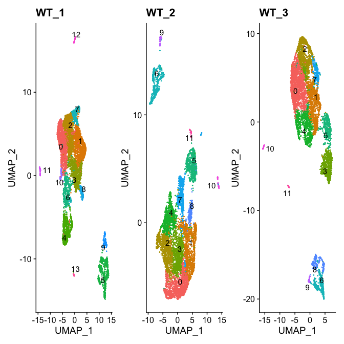
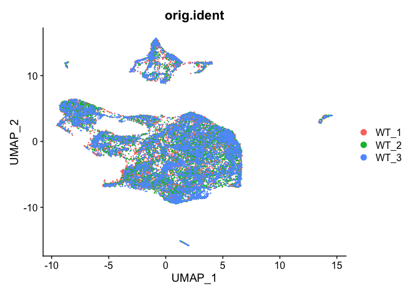
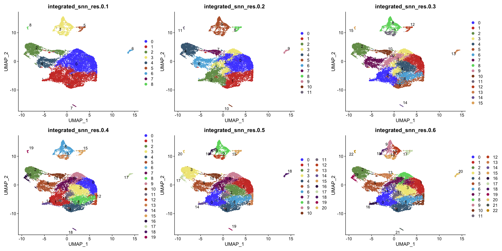

Integration of WT_1,2,3 R Notebook
================

<style type="text/css">
caption {
      color: blue;
      font-weight: bold;
      font-size: 2.0em;
    }
</style>

``` r
library(Seurat)
library(sctransform)
library(ggplot2)
library(dplyr)
library(ggsci)
library(cowplot)
library(scater)
library(patchwork)
options(future.globals.maxSize = 4000 * 1024^2)
```

``` r
mypal <- pal_igv(palette = "default",alpha = 1)(30)
mem.maxVSize(vsize = 32000000000)
```

    ## [1] 3.2e+10

# Read Data

``` r
WT_1 <- readRDS("RDSfiles/WT_1.clustered.RDS")
WT_2 <- readRDS("RDSfiles/WT_2.clustered.RDS")
WT_3 <- readRDS("RDSfiles/WT_3.clustered.RDS")
```

# UMAPs of each sample

``` r
Idents(WT_1) <- "SCT_snn_res.0.3"
Idents(WT_2) <- "SCT_snn_res.0.3"
Idents(WT_3) <- "SCT_snn_res.0.3"

p4 <- DimPlot(WT_1, label = T, repel = T) + NoLegend() + ggtitle("WT_1")
p5 <- DimPlot(WT_2, label = T, repel = T) + NoLegend() + ggtitle("WT_2")
p6 <- DimPlot(WT_3, label = T, repel = T) + NoLegend() + ggtitle("WT_3")
p4 + p5 + p6
```

<!-- -->

# Integrate all 3 datasets

``` r
WT_1$KO_type <- "WT"
WT_2$KO_type <- "WT"
WT_3$KO_type <- "WT"
```

``` r
seuratlist <- list(WT_1, WT_2, WT_3)
features <- SelectIntegrationFeatures(object.list = seuratlist, nfeatures = 3000)
seuratlist <- PrepSCTIntegration(object.list = seuratlist, anchor.features = features)
seurat.anchors <- FindIntegrationAnchors(object.list = seuratlist, normalization.method = "SCT",
    anchor.features = features)
```

    ## Warning in CheckDuplicateCellNames(object.list = object.list): Some cell names
    ## are duplicated across objects provided. Renaming to enforce unique cell names.

    ## Finding all pairwise anchors

    ## Running CCA

    ## Merging objects

    ## Finding neighborhoods

    ## Finding anchors

    ##  Found 18175 anchors

    ## Filtering anchors

    ##  Retained 16915 anchors

    ## Running CCA

    ## Merging objects

    ## Finding neighborhoods

    ## Finding anchors

    ##  Found 17929 anchors

    ## Filtering anchors

    ##  Retained 16703 anchors

    ## Running CCA

    ## Merging objects

    ## Finding neighborhoods

    ## Finding anchors

    ##  Found 17457 anchors

    ## Filtering anchors

    ##  Retained 16193 anchors

``` r
int.seurat <- IntegrateData(anchorset = seurat.anchors, normalization.method = "SCT")
```

    ## Merging dataset 2 into 1

    ## Extracting anchors for merged samples

    ## Finding integration vectors

    ## Finding integration vector weights

    ## Integrating data

    ## Merging dataset 3 into 1 2

    ## Extracting anchors for merged samples

    ## Finding integration vectors

    ## Finding integration vector weights

    ## Integrating data

``` r
int.seurat <- RunPCA(int.seurat, verbose = FALSE)
int.seurat <- RunUMAP(int.seurat, reduction = "pca", dims = 1:30)
```

    ## Warning: The default method for RunUMAP has changed from calling Python UMAP via reticulate to the R-native UWOT using the cosine metric
    ## To use Python UMAP via reticulate, set umap.method to 'umap-learn' and metric to 'correlation'
    ## This message will be shown once per session

    ## 13:40:03 UMAP embedding parameters a = 0.9922 b = 1.112

    ## 13:40:03 Read 22221 rows and found 30 numeric columns

    ## 13:40:03 Using Annoy for neighbor search, n_neighbors = 30

    ## 13:40:03 Building Annoy index with metric = cosine, n_trees = 50

    ## 0%   10   20   30   40   50   60   70   80   90   100%

    ## [----|----|----|----|----|----|----|----|----|----|

    ## **************************************************|
    ## 13:40:04 Writing NN index file to temp file /var/folders/5l/4z632ppn6k795v72dh_jd98m0000gn/T//RtmpR838jJ/file656b10629517
    ## 13:40:04 Searching Annoy index using 1 thread, search_k = 3000
    ## 13:40:09 Annoy recall = 100%
    ## 13:40:09 Commencing smooth kNN distance calibration using 1 thread with target n_neighbors = 30
    ## 13:40:10 Initializing from normalized Laplacian + noise (using irlba)
    ## 13:40:11 Commencing optimization for 200 epochs, with 913002 positive edges
    ## 13:40:21 Optimization finished

## UMAP of integrated dataset - all 3

``` r
p1 <- DimPlot(int.seurat, reduction = "umap", group.by = "orig.ident")
#p2 <- DimPlot(int.seurat, reduction = "umap", group.by = "seurat_annotations", label = TRUE,
#    repel = TRUE)
p1
```

<!-- -->

``` r
int.seurat <- FindNeighbors(int.seurat, verbose = F, dims = 1:30)
int.seurat <- FindClusters(int.seurat, resolution = 0.1, verbose = F)
int.seurat <- FindClusters(int.seurat, resolution = 0.2, verbose = F)
int.seurat <- FindClusters(int.seurat, resolution = 0.3, verbose = F)
int.seurat <- FindClusters(int.seurat, resolution = 0.4, verbose = F)
int.seurat <- FindClusters(int.seurat, resolution = 0.5, verbose = F)
int.seurat <- FindClusters(int.seurat, resolution = 0.6, verbose = F)
```

## UMAPs of clusters resolutions 0.1 to 0.6

``` r
p1 <- DimPlot(int.seurat, label = T, repel = T, group.by = "integrated_snn_res.0.1") + scale_color_igv()
p2 <- DimPlot(int.seurat, label = T, repel = T, group.by = "integrated_snn_res.0.2") + scale_color_igv()
p3 <- DimPlot(int.seurat, label = T, repel = T, group.by = "integrated_snn_res.0.3") + scale_color_igv() 
p4 <- DimPlot(int.seurat, label = T, repel = T, group.by = "integrated_snn_res.0.4") + scale_color_igv()
p5 <- DimPlot(int.seurat, label = T, repel = T, group.by = "integrated_snn_res.0.5") + scale_color_igv()
p6 <- DimPlot(int.seurat, label = T, repel = T, group.by = "integrated_snn_res.0.6") + scale_color_igv()
p1 + p2 + p3 + p4 + p5 + p6
```

<!-- -->

``` r
#saveRDS(int.seurat, file = "RDSfiles/int3.clustered.RDS")
```

``` r
sessionInfo()
```

    ## R version 4.2.2 (2022-10-31)
    ## Platform: aarch64-apple-darwin20 (64-bit)
    ## Running under: macOS Monterey 12.4
    ## 
    ## Matrix products: default
    ## BLAS:   /Library/Frameworks/R.framework/Versions/4.2-arm64/Resources/lib/libRblas.0.dylib
    ## LAPACK: /Library/Frameworks/R.framework/Versions/4.2-arm64/Resources/lib/libRlapack.dylib
    ## 
    ## locale:
    ## [1] en_US.UTF-8/en_US.UTF-8/en_US.UTF-8/C/en_US.UTF-8/en_US.UTF-8
    ## 
    ## attached base packages:
    ## [1] stats4    stats     graphics  grDevices utils     datasets  methods  
    ## [8] base     
    ## 
    ## other attached packages:
    ##  [1] patchwork_1.1.2             scater_1.26.1              
    ##  [3] scuttle_1.8.3               SingleCellExperiment_1.20.0
    ##  [5] SummarizedExperiment_1.28.0 Biobase_2.58.0             
    ##  [7] GenomicRanges_1.50.2        GenomeInfoDb_1.34.6        
    ##  [9] IRanges_2.32.0              S4Vectors_0.36.1           
    ## [11] BiocGenerics_0.44.0         MatrixGenerics_1.10.0      
    ## [13] matrixStats_0.63.0          cowplot_1.1.1              
    ## [15] ggsci_2.9                   dplyr_1.0.10               
    ## [17] ggplot2_3.4.0               sctransform_0.3.5          
    ## [19] SeuratObject_4.1.3          Seurat_4.3.0               
    ## 
    ## loaded via a namespace (and not attached):
    ##   [1] plyr_1.8.8                igraph_1.3.5             
    ##   [3] lazyeval_0.2.2            sp_1.5-1                 
    ##   [5] splines_4.2.2             BiocParallel_1.32.5      
    ##   [7] listenv_0.9.0             scattermore_0.8          
    ##   [9] digest_0.6.31             htmltools_0.5.4          
    ##  [11] viridis_0.6.2             fansi_1.0.3              
    ##  [13] magrittr_2.0.3            ScaledMatrix_1.6.0       
    ##  [15] tensor_1.5                cluster_2.1.4            
    ##  [17] ROCR_1.0-11               globals_0.16.2           
    ##  [19] spatstat.sparse_3.0-0     colorspace_2.0-3         
    ##  [21] ggrepel_0.9.2             xfun_0.36                
    ##  [23] RCurl_1.98-1.9            jsonlite_1.8.4           
    ##  [25] progressr_0.12.0          spatstat.data_3.0-0      
    ##  [27] survival_3.4-0            zoo_1.8-11               
    ##  [29] glue_1.6.2                polyclip_1.10-4          
    ##  [31] gtable_0.3.1              zlibbioc_1.44.0          
    ##  [33] XVector_0.38.0            leiden_0.4.3             
    ##  [35] DelayedArray_0.24.0       BiocSingular_1.14.0      
    ##  [37] future.apply_1.10.0       abind_1.4-5              
    ##  [39] scales_1.2.1              DBI_1.1.3                
    ##  [41] spatstat.random_3.0-1     miniUI_0.1.1.1           
    ##  [43] Rcpp_1.0.9                viridisLite_0.4.1        
    ##  [45] xtable_1.8-4              reticulate_1.26          
    ##  [47] rsvd_1.0.5                htmlwidgets_1.6.0        
    ##  [49] httr_1.4.4                RColorBrewer_1.1-3       
    ##  [51] ellipsis_0.3.2            ica_1.0-3                
    ##  [53] farver_2.1.1              pkgconfig_2.0.3          
    ##  [55] uwot_0.1.14               deldir_1.0-6             
    ##  [57] utf8_1.2.2                labeling_0.4.2           
    ##  [59] tidyselect_1.2.0          rlang_1.0.6              
    ##  [61] reshape2_1.4.4            later_1.3.0              
    ##  [63] munsell_0.5.0             tools_4.2.2              
    ##  [65] cli_3.5.0                 generics_0.1.3           
    ##  [67] ggridges_0.5.4            evaluate_0.19            
    ##  [69] stringr_1.5.0             fastmap_1.1.0            
    ##  [71] yaml_2.3.6                goftest_1.2-3            
    ##  [73] knitr_1.41                fitdistrplus_1.1-8       
    ##  [75] purrr_1.0.0               RANN_2.6.1               
    ##  [77] pbapply_1.6-0             future_1.30.0            
    ##  [79] nlme_3.1-161              sparseMatrixStats_1.10.0 
    ##  [81] mime_0.12                 compiler_4.2.2           
    ##  [83] rstudioapi_0.14           beeswarm_0.4.0           
    ##  [85] plotly_4.10.1             png_0.1-8                
    ##  [87] spatstat.utils_3.0-1      tibble_3.1.8             
    ##  [89] stringi_1.7.8             highr_0.10               
    ##  [91] lattice_0.20-45           Matrix_1.5-3             
    ##  [93] vctrs_0.5.1               pillar_1.8.1             
    ##  [95] lifecycle_1.0.3           spatstat.geom_3.0-3      
    ##  [97] lmtest_0.9-40             RcppAnnoy_0.0.20         
    ##  [99] BiocNeighbors_1.16.0      data.table_1.14.6        
    ## [101] bitops_1.0-7              irlba_2.3.5.1            
    ## [103] httpuv_1.6.7              R6_2.5.1                 
    ## [105] promises_1.2.0.1          KernSmooth_2.23-20       
    ## [107] gridExtra_2.3             vipor_0.4.5              
    ## [109] parallelly_1.33.0         codetools_0.2-18         
    ## [111] MASS_7.3-58.1             assertthat_0.2.1         
    ## [113] withr_2.5.0               GenomeInfoDbData_1.2.9   
    ## [115] parallel_4.2.2            grid_4.2.2               
    ## [117] beachmat_2.14.0           tidyr_1.2.1              
    ## [119] rmarkdown_2.19            DelayedMatrixStats_1.20.0
    ## [121] Rtsne_0.16                spatstat.explore_3.0-5   
    ## [123] shiny_1.7.4               ggbeeswarm_0.7.1
