WT Preprocess and QC R Notebook
================

``` r
library(Seurat)
library(sctransform)
library(ggplot2)
library(dplyr)
library(ggsci)
library(cowplot)
library(scater)
library(patchwork)
library(glmGamPoi)
options(future.globals.maxSize = 4000 * 1024^2)
```

``` r
GetQCplots <- function(seurat, mitoPattern){
  seurat[["percent.mt"]] <- PercentageFeatureSet(seurat, pattern = mitoPattern)
  v <- VlnPlot(seurat, features = c("nFeature_RNA", "nCount_RNA", "percent.mt"), ncol = 3)
  f1 <- FeatureScatter(seurat, feature1 = "nCount_RNA", feature2 = "percent.mt")
  f2 <- FeatureScatter(seurat, feature1 = "nFeature_RNA", feature2 = "percent.mt")
  f3 <- FeatureScatter(seurat, feature1 = "nCount_RNA", feature2 = "nFeature_RNA")
  
  qc1 <- ggplot(seurat@meta.data, aes(x=nCount_RNA, y=nFeature_RNA, color=percent.mt)) + geom_point(size=0.1) +
    scale_color_gradient(low="blue",high="red") + theme_classic()

  qc2 <- ggplot(seurat@meta.data, aes(x=nCount_RNA, y=percent.mt)) + geom_point(size=0.1) + scale_x_log10() +
    geom_density2d()

  qc3 <- ggplot(seurat@meta.data, aes(x=nCount_RNA, y=nFeature_RNA ,color=percent.mt)) + geom_point(size=0.1) +
    scale_x_log10() + scale_y_log10() + geom_density2d() +
    scale_color_gradient(low="gray",high="darkblue") + theme_classic()

  print(v)
  print(f1)
  print(f2)
  print(f3)
  print(qc1)
  print(qc2)
  print(qc3)

  return(seurat)
}
```

# Load data

``` r
WT_1_data <- Read10X(data.dir = "data/WT_1/")
WT_1 <- CreateSeuratObject(WT_1_data, project = "WT_1")
WT_2_data <- Read10X(data.dir = "data/WT_2/")
WT_2 <- CreateSeuratObject(WT_2_data, project = "WT_2")
WT_3_data <- Read10X(data.dir = "data/WT_3/")
WT_3 <- CreateSeuratObject(WT_3_data, project = "WT_3")
```

# QC plots

## WT_1

``` r
WT_1 <- GetQCplots(WT_1, "^mt-")
```

<!-- -->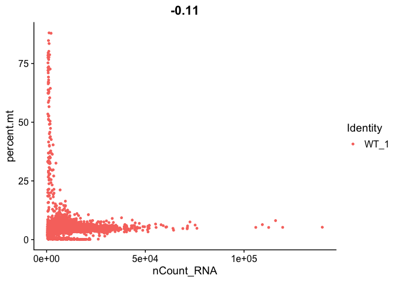<!-- -->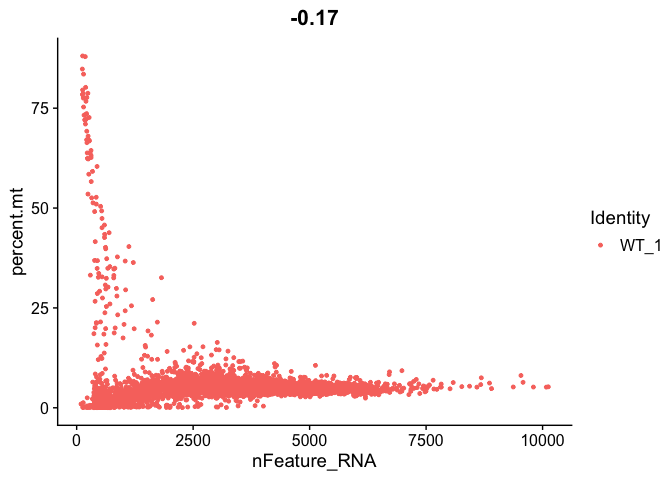<!-- -->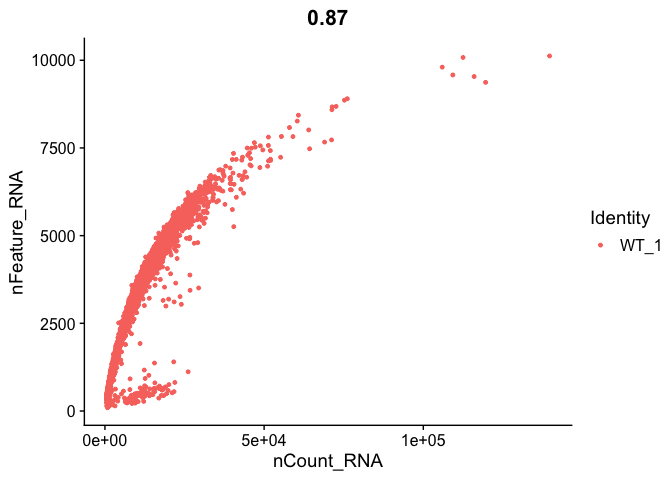<!-- -->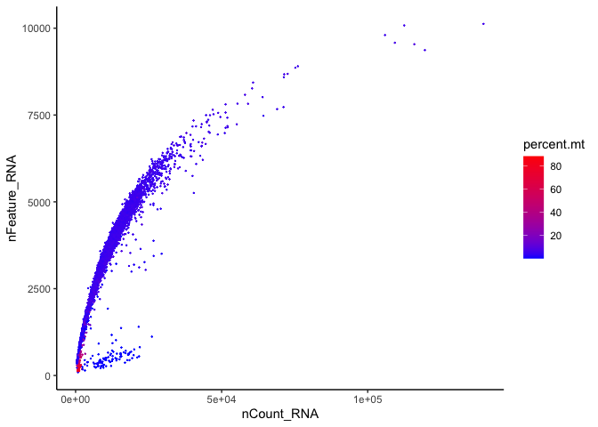<!-- -->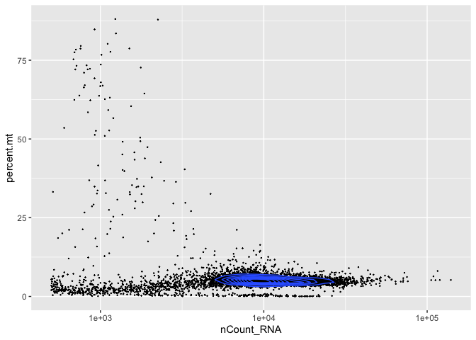<!-- -->

    ## Warning: The following aesthetics were dropped during statistical transformation: colour
    ## ℹ This can happen when ggplot fails to infer the correct grouping structure in
    ##   the data.
    ## ℹ Did you forget to specify a `group` aesthetic or to convert a numerical
    ##   variable into a factor?

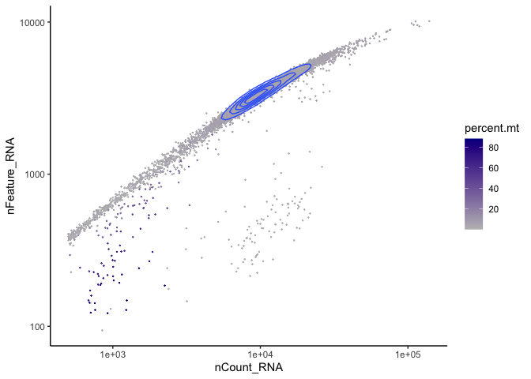<!-- -->

## WT_2

``` r
WT_2 <- GetQCplots(WT_2, "^mt-")
```

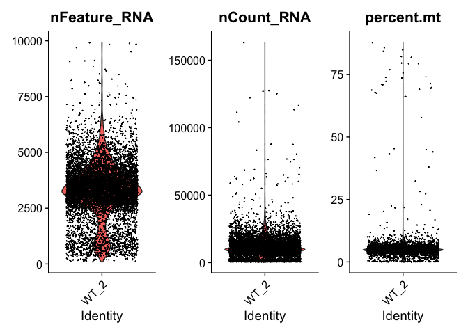<!-- -->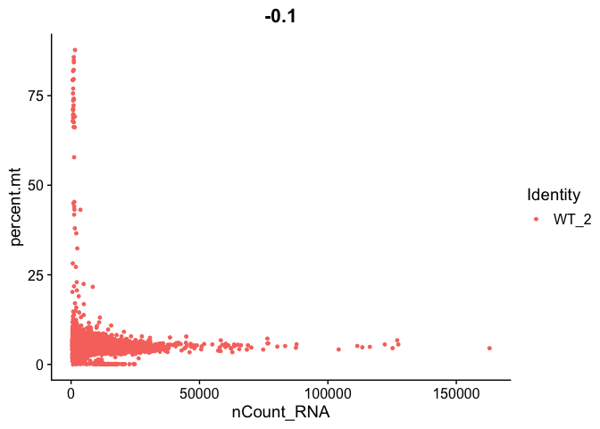<!-- -->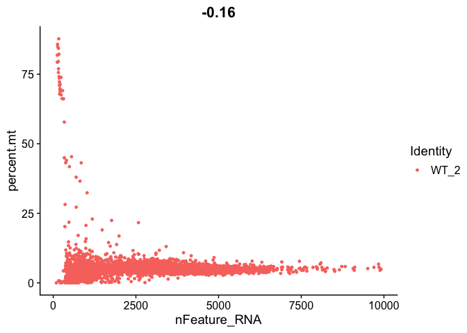<!-- -->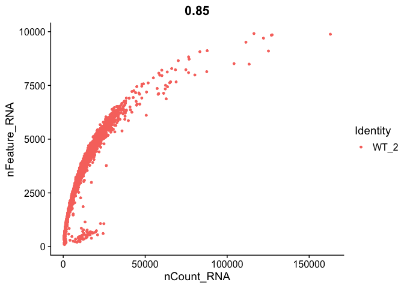<!-- -->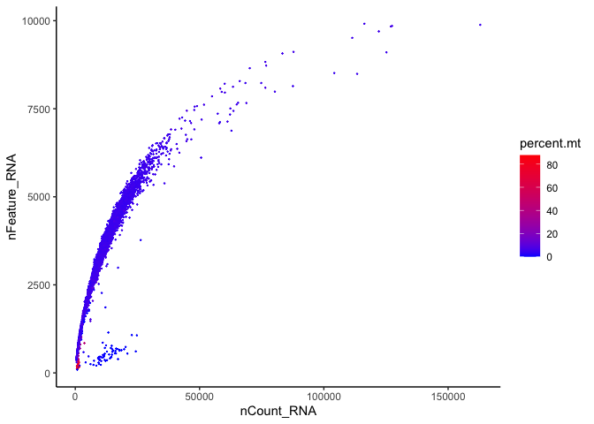<!-- -->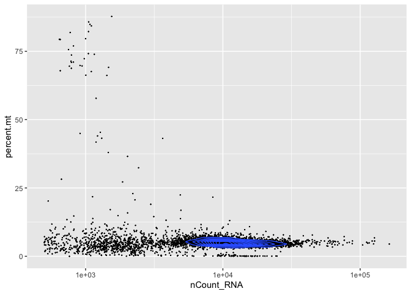<!-- -->

    ## Warning: The following aesthetics were dropped during statistical transformation: colour
    ## ℹ This can happen when ggplot fails to infer the correct grouping structure in
    ##   the data.
    ## ℹ Did you forget to specify a `group` aesthetic or to convert a numerical
    ##   variable into a factor?

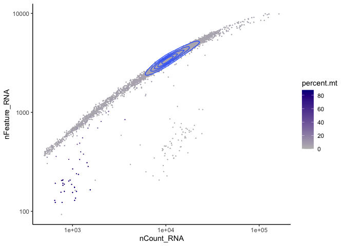<!-- -->

## WT_3

``` r
WT_3 <- GetQCplots(WT_3, "^mt-")
```

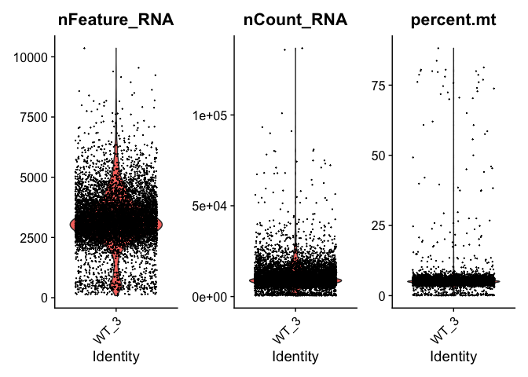<!-- -->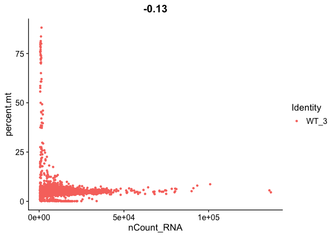<!-- -->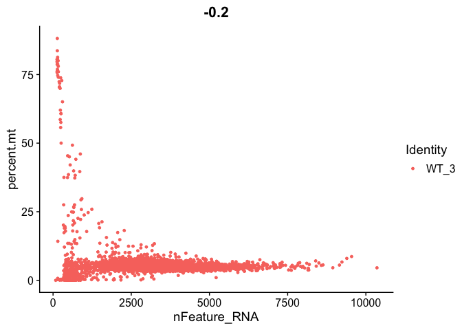<!-- --><!-- -->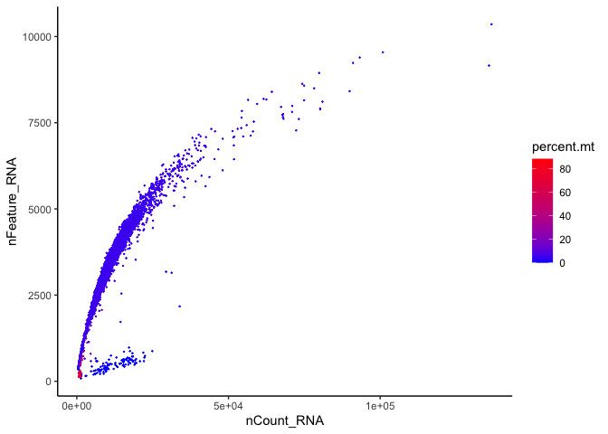<!-- -->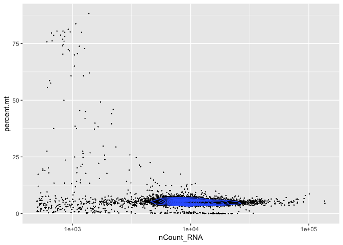<!-- -->

    ## Warning: The following aesthetics were dropped during statistical transformation: colour
    ## ℹ This can happen when ggplot fails to infer the correct grouping structure in
    ##   the data.
    ## ℹ Did you forget to specify a `group` aesthetic or to convert a numerical
    ##   variable into a factor?

<!-- -->

# Outliers and subset

## WT_1

``` r
WT_1$nCount_RNA_drop <- isOutlier(WT_1$nCount_RNA, nmads = 3,
                                  type = "both", log = TRUE)
WT_1$nFeature_RNA_drop <- isOutlier(WT_1$nFeature_RNA, nmads = 3,
                                    type = "both", log = TRUE)
WT_1$percent.mt_drop <- isOutlier(WT_1$percent.mt, nmads = 3,
                                  type = "higher", log = TRUE)
WT_1$outlier <- WT_1$nCount_RNA_drop | WT_1$nFeature_RNA_drop | WT_1$percent.mt_drop
table(WT_1$outlier)
```

    ## 
    ## FALSE  TRUE 
    ##  7959  1067

``` r
table(WT_1$nCount_RNA_drop)
```

    ## 
    ## FALSE  TRUE 
    ##  8230   796

``` r
table(WT_1$nFeature_RNA_drop)
```

    ## 
    ## FALSE  TRUE 
    ##  8147   879

``` r
table(WT_1$percent.mt_drop)
```

    ## 
    ## FALSE  TRUE 
    ##  8802   224

``` r
ggplot(WT_1@meta.data, aes(x=nCount_RNA, y=nFeature_RNA ,color=outlier)) + geom_point(size=0.1) +
    scale_x_log10() + scale_y_log10() + geom_density2d() + theme_classic()
```

    ## Warning: `stat_contour()`: Zero contours were generated

    ## Warning in min(x): no non-missing arguments to min; returning Inf

    ## Warning in max(x): no non-missing arguments to max; returning -Inf

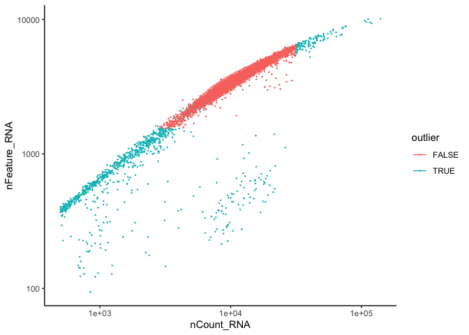<!-- -->

``` r
WT_1 <- subset(WT_1,  subset = outlier == FALSE)
WT_1
```

    ## An object of class Seurat 
    ## 27998 features across 7959 samples within 1 assay 
    ## Active assay: RNA (27998 features, 0 variable features)

## WT_2

``` r
WT_2$nCount_RNA_drop <- isOutlier(WT_2$nCount_RNA, nmads = 3,
                                  type = "both", log = TRUE)
WT_2$nFeature_RNA_drop <- isOutlier(WT_2$nFeature_RNA, nmads = 3,
                                    type = "both", log = TRUE)
WT_2$percent.mt_drop <- isOutlier(WT_2$percent.mt, nmads = 3,
                                  type = "higher", log = TRUE)
WT_2$outlier <- WT_2$nCount_RNA_drop | WT_2$nFeature_RNA_drop | WT_2$percent.mt_drop
table(WT_2$outlier)
```

    ## 
    ## FALSE  TRUE 
    ##  6994  1031

``` r
table(WT_2$nCount_RNA_drop)
```

    ## 
    ## FALSE  TRUE 
    ##  7127   898

``` r
table(WT_2$nFeature_RNA_drop)
```

    ## 
    ## FALSE  TRUE 
    ##  7101   924

``` r
table(WT_2$percent.mt_drop)
```

    ## 
    ## FALSE  TRUE 
    ##  7853   172

``` r
ggplot(WT_2@meta.data, aes(x=nCount_RNA, y=nFeature_RNA ,color=outlier)) + geom_point(size=0.1) +
    scale_x_log10() + scale_y_log10() + geom_density2d() + theme_classic()
```

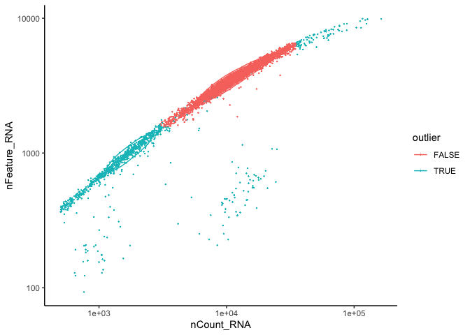<!-- -->

``` r
WT_2 <- subset(WT_2,  subset = outlier == FALSE)
WT_2
```

    ## An object of class Seurat 
    ## 27998 features across 6994 samples within 1 assay 
    ## Active assay: RNA (27998 features, 0 variable features)

## WT_3

``` r
WT_3$nCount_RNA_drop <- isOutlier(WT_3$nCount_RNA, nmads = 3,
                                  type = "both", log = TRUE)
WT_3$nFeature_RNA_drop <- isOutlier(WT_3$nFeature_RNA, nmads = 3,
                                    type = "both", log = TRUE)
WT_3$percent.mt_drop <- isOutlier(WT_3$percent.mt, nmads = 3,
                                  type = "higher", log = TRUE)
WT_3$outlier <- WT_3$nCount_RNA_drop | WT_3$nFeature_RNA_drop | WT_3$percent.mt_drop
table(WT_3$outlier)
```

    ## 
    ## FALSE  TRUE 
    ##  7268   701

``` r
table(WT_3$nCount_RNA_drop)
```

    ## 
    ## FALSE  TRUE 
    ##  7453   516

``` r
table(WT_3$nFeature_RNA_drop)
```

    ## 
    ## FALSE  TRUE 
    ##  7416   553

``` r
table(WT_3$percent.mt_drop)
```

    ## 
    ## FALSE  TRUE 
    ##  7809   160

``` r
ggplot(WT_3@meta.data, aes(x=nCount_RNA, y=nFeature_RNA ,color=outlier)) + geom_point(size=0.1) +
    scale_x_log10() + scale_y_log10() + geom_density2d() + theme_classic()
```

    ## Warning: `stat_contour()`: Zero contours were generated

    ## Warning in min(x): no non-missing arguments to min; returning Inf

    ## Warning in max(x): no non-missing arguments to max; returning -Inf

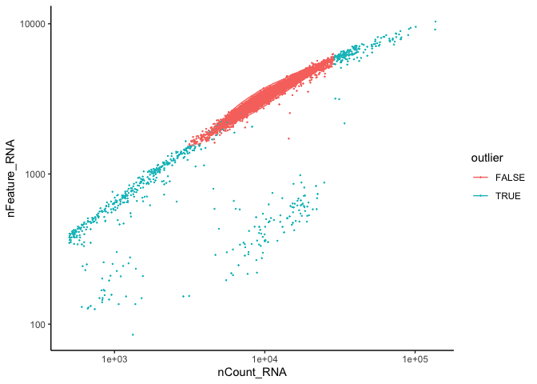<!-- -->

``` r
WT_3 <- subset(WT_3,  subset = outlier == FALSE)
WT_3
```

    ## An object of class Seurat 
    ## 27998 features across 7268 samples within 1 assay 
    ## Active assay: RNA (27998 features, 0 variable features)

``` r
#saveRDS(WT_1, file = "RDSfiles/WT_1.RDS")
#saveRDS(WT_2, file = "RDSfiles/WT_2.RDS")
#saveRDS(WT_3, file = "RDSfiles/WT_3.RDS")
```

# Normalization

``` r
WT_1 <- SCTransform(WT_1, method = "glmGamPoi", assay = 'RNA', new.assay.name = 'SCT', return.only.var.genes = FALSE)
```

``` r
WT_2 <- SCTransform(WT_2, method = "glmGamPoi", assay = 'RNA', new.assay.name = 'SCT', return.only.var.genes = FALSE)
```

``` r
WT_3 <- SCTransform(WT_3, method = "glmGamPoi", assay = 'RNA', new.assay.name = 'SCT', return.only.var.genes = FALSE)
```

# Perform Dimensionality

``` r
GetUMAPandClusters <- function(seurat){
  DefaultAssay(seurat) <- "SCT"
  seurat <- RunPCA(seurat, verbose = F, npcs = 50)
  print(ElbowPlot(seurat, ndims = 50))
  seurat <- RunUMAP(seurat, dims = 1:30, verbose = F)
  seurat <- FindNeighbors(seurat, verbose = F, dims = 1:30)
  seurat <- FindClusters(seurat, resolution = 0.3, verbose = F)
  seurat <- FindClusters(seurat, resolution = 0.4, verbose = F)
  seurat <- FindClusters(seurat, resolution = 0.5, verbose = F)
  seurat <- FindClusters(seurat, resolution = 0.6, verbose = F)
  seurat <- FindClusters(seurat, resolution = 0.7, verbose = F)
  seurat <- FindClusters(seurat, resolution = 0.8, verbose = F)
  seurat <- FindClusters(seurat, resolution = 0.9, verbose = F)
  seurat <- FindClusters(seurat, resolution = 1.0, verbose = F)
  
  return(seurat)
}
```

## WT_1

``` r
WT_1 <- GetUMAPandClusters(WT_1)
```

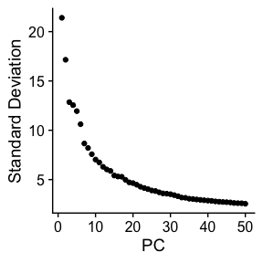<!-- -->

``` r
p1 <- DimPlot(WT_1, label = T, repel = T, group.by = "SCT_snn_res.0.3") + scale_color_igv()
p2 <- DimPlot(WT_1, label = T, repel = T, group.by = "SCT_snn_res.0.4") + scale_color_igv()
p3 <- DimPlot(WT_1, label = T, repel = T, group.by = "SCT_snn_res.0.5") + scale_color_igv() 
p4 <- DimPlot(WT_1, label = T, repel = T, group.by = "SCT_snn_res.0.6") + scale_color_igv()
p5 <- DimPlot(WT_1, label = T, repel = T, group.by = "SCT_snn_res.0.7") + scale_color_igv()
p6 <- DimPlot(WT_1, label = T, repel = T, group.by = "SCT_snn_res.0.8") + scale_color_igv()
p7 <- DimPlot(WT_1, label = T, repel = T, group.by = "SCT_snn_res.0.9") + scale_color_igv()
p8 <- DimPlot(WT_1, label = T, repel = T, group.by = "SCT_snn_res.1") + scale_color_igv()
p1 + p2 + p3 + p4 + p5 + p6 + p7 + p8
```

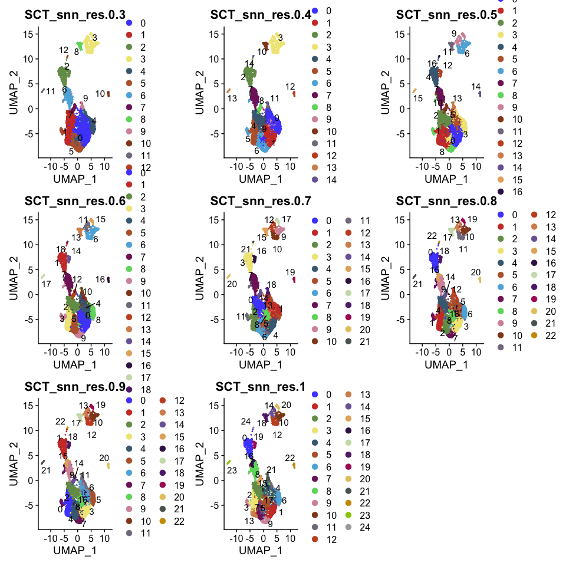<!-- -->

## WT_2

``` r
WT_2 <- GetUMAPandClusters(WT_2)
```

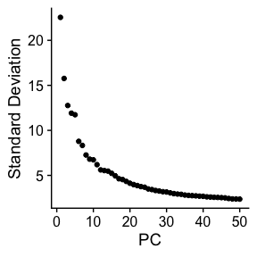<!-- -->

``` r
p1 <- DimPlot(WT_2, label = T, repel = T, group.by = "SCT_snn_res.0.3") + scale_color_igv()
p2 <- DimPlot(WT_2, label = T, repel = T, group.by = "SCT_snn_res.0.4") + scale_color_igv()
p3 <- DimPlot(WT_2, label = T, repel = T, group.by = "SCT_snn_res.0.5") + scale_color_igv() 
p4 <- DimPlot(WT_2, label = T, repel = T, group.by = "SCT_snn_res.0.6") + scale_color_igv()
p5 <- DimPlot(WT_2, label = T, repel = T, group.by = "SCT_snn_res.0.7") + scale_color_igv()
p6 <- DimPlot(WT_2, label = T, repel = T, group.by = "SCT_snn_res.0.8") + scale_color_igv()
p7 <- DimPlot(WT_2, label = T, repel = T, group.by = "SCT_snn_res.0.9") + scale_color_igv()
p8 <- DimPlot(WT_2, label = T, repel = T, group.by = "SCT_snn_res.1") + scale_color_igv()
p1 + p2 + p3 + p4 + p5 + p6 + p7 + p8
```

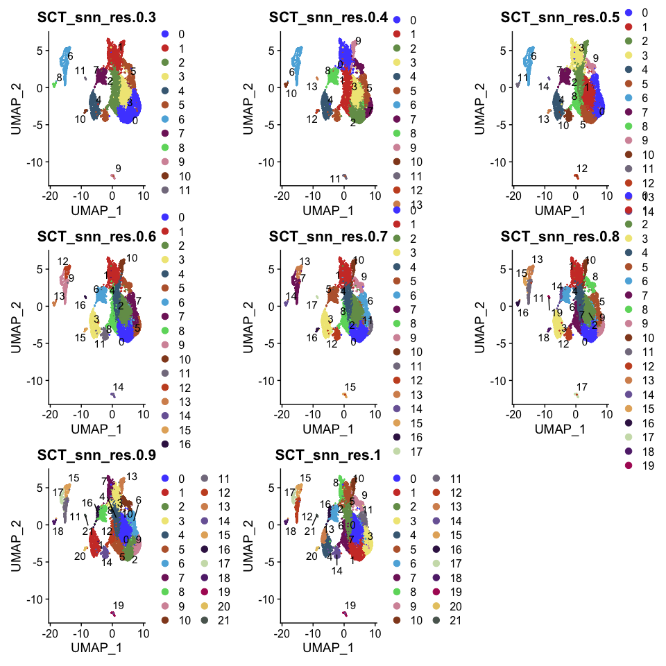<!-- -->

## WT_3

``` r
WT_3 <- GetUMAPandClusters(WT_3)
```

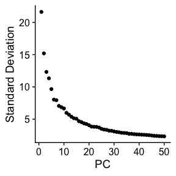<!-- -->

``` r
p1 <- DimPlot(WT_3, label = T, repel = T, group.by = "SCT_snn_res.0.3") + scale_color_igv()
p2 <- DimPlot(WT_3, label = T, repel = T, group.by = "SCT_snn_res.0.4") + scale_color_igv()
p3 <- DimPlot(WT_3, label = T, repel = T, group.by = "SCT_snn_res.0.5") + scale_color_igv() 
p4 <- DimPlot(WT_3, label = T, repel = T, group.by = "SCT_snn_res.0.6") + scale_color_igv()
p5 <- DimPlot(WT_3, label = T, repel = T, group.by = "SCT_snn_res.0.7") + scale_color_igv()
p6 <- DimPlot(WT_3, label = T, repel = T, group.by = "SCT_snn_res.0.8") + scale_color_igv()
p7 <- DimPlot(WT_3, label = T, repel = T, group.by = "SCT_snn_res.0.9") + scale_color_igv()
p8 <- DimPlot(WT_3, label = T, repel = T, group.by = "SCT_snn_res.1") + scale_color_igv()
p1 + p2 + p3 + p4 + p5 + p6 + p7 + p8
```

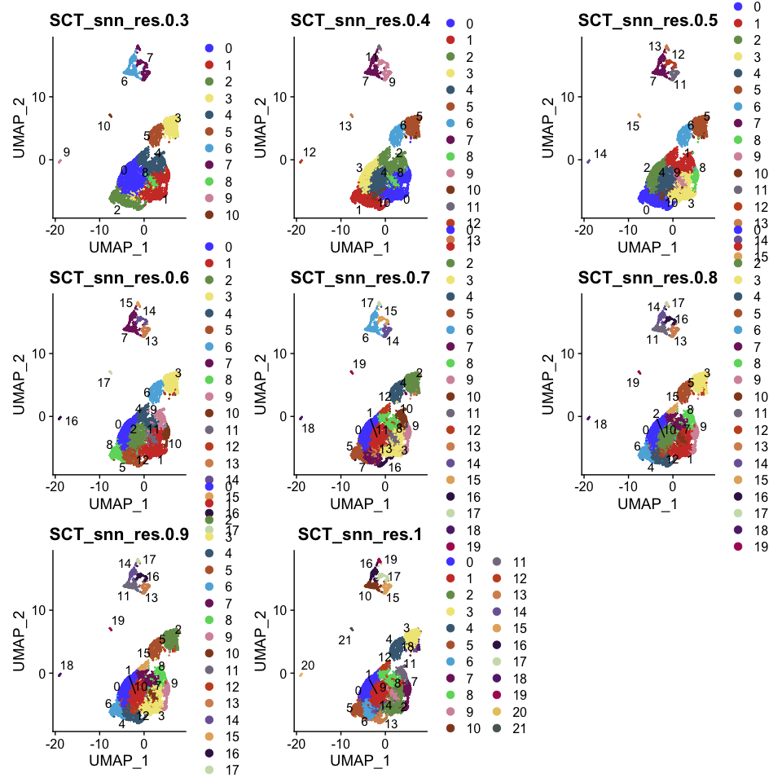<!-- -->

``` r
#saveRDS(WT_1, file = "RDSfiles/WT_1.clustered.RDS")
#saveRDS(WT_2, file = "RDSfiles/WT_2.clustered.RDS")
#saveRDS(WT_3, file = "RDSfiles/WT_3.clustered.RDS")
```

``` r
sessionInfo()
```

    ## R version 4.2.2 (2022-10-31)
    ## Platform: aarch64-apple-darwin20 (64-bit)
    ## Running under: macOS Monterey 12.4
    ## 
    ## Matrix products: default
    ## BLAS:   /Library/Frameworks/R.framework/Versions/4.2-arm64/Resources/lib/libRblas.0.dylib
    ## LAPACK: /Library/Frameworks/R.framework/Versions/4.2-arm64/Resources/lib/libRlapack.dylib
    ## 
    ## locale:
    ## [1] en_US.UTF-8/en_US.UTF-8/en_US.UTF-8/C/en_US.UTF-8/en_US.UTF-8
    ## 
    ## attached base packages:
    ## [1] stats4    stats     graphics  grDevices utils     datasets  methods  
    ## [8] base     
    ## 
    ## other attached packages:
    ##  [1] glmGamPoi_1.10.1            patchwork_1.1.2            
    ##  [3] scater_1.26.1               scuttle_1.8.3              
    ##  [5] SingleCellExperiment_1.20.0 SummarizedExperiment_1.28.0
    ##  [7] Biobase_2.58.0              GenomicRanges_1.50.2       
    ##  [9] GenomeInfoDb_1.34.6         IRanges_2.32.0             
    ## [11] S4Vectors_0.36.1            BiocGenerics_0.44.0        
    ## [13] MatrixGenerics_1.10.0       matrixStats_0.63.0         
    ## [15] cowplot_1.1.1               ggsci_2.9                  
    ## [17] dplyr_1.0.10                ggplot2_3.4.0              
    ## [19] sctransform_0.3.5           SeuratObject_4.1.3         
    ## [21] Seurat_4.3.0               
    ## 
    ## loaded via a namespace (and not attached):
    ##   [1] plyr_1.8.8                igraph_1.3.5             
    ##   [3] lazyeval_0.2.2            sp_1.5-1                 
    ##   [5] splines_4.2.2             BiocParallel_1.32.5      
    ##   [7] listenv_0.9.0             scattermore_0.8          
    ##   [9] digest_0.6.31             htmltools_0.5.4          
    ##  [11] viridis_0.6.2             fansi_1.0.3              
    ##  [13] magrittr_2.0.3            ScaledMatrix_1.6.0       
    ##  [15] tensor_1.5                cluster_2.1.4            
    ##  [17] ROCR_1.0-11               globals_0.16.2           
    ##  [19] spatstat.sparse_3.0-0     colorspace_2.0-3         
    ##  [21] ggrepel_0.9.2             xfun_0.36                
    ##  [23] crayon_1.5.2              RCurl_1.98-1.9           
    ##  [25] jsonlite_1.8.4            progressr_0.12.0         
    ##  [27] spatstat.data_3.0-0       survival_3.4-0           
    ##  [29] zoo_1.8-11                glue_1.6.2               
    ##  [31] polyclip_1.10-4           gtable_0.3.1             
    ##  [33] zlibbioc_1.44.0           XVector_0.38.0           
    ##  [35] leiden_0.4.3              DelayedArray_0.24.0      
    ##  [37] BiocSingular_1.14.0       future.apply_1.10.0      
    ##  [39] abind_1.4-5               scales_1.2.1             
    ##  [41] DBI_1.1.3                 spatstat.random_3.0-1    
    ##  [43] miniUI_0.1.1.1            Rcpp_1.0.9               
    ##  [45] isoband_0.2.7             viridisLite_0.4.1        
    ##  [47] xtable_1.8-4              reticulate_1.26          
    ##  [49] rsvd_1.0.5                htmlwidgets_1.6.0        
    ##  [51] httr_1.4.4                RColorBrewer_1.1-3       
    ##  [53] ellipsis_0.3.2            ica_1.0-3                
    ##  [55] farver_2.1.1              pkgconfig_2.0.3          
    ##  [57] uwot_0.1.14               deldir_1.0-6             
    ##  [59] utf8_1.2.2                labeling_0.4.2           
    ##  [61] tidyselect_1.2.0          rlang_1.0.6              
    ##  [63] reshape2_1.4.4            later_1.3.0              
    ##  [65] munsell_0.5.0             tools_4.2.2              
    ##  [67] cli_3.5.0                 generics_0.1.3           
    ##  [69] ggridges_0.5.4            evaluate_0.19            
    ##  [71] stringr_1.5.0             fastmap_1.1.0            
    ##  [73] yaml_2.3.6                goftest_1.2-3            
    ##  [75] knitr_1.41                fitdistrplus_1.1-8       
    ##  [77] purrr_1.0.0               RANN_2.6.1               
    ##  [79] pbapply_1.6-0             future_1.30.0            
    ##  [81] nlme_3.1-161              sparseMatrixStats_1.10.0 
    ##  [83] mime_0.12                 ggrastr_1.0.1            
    ##  [85] compiler_4.2.2            rstudioapi_0.14          
    ##  [87] beeswarm_0.4.0            plotly_4.10.1            
    ##  [89] png_0.1-8                 spatstat.utils_3.0-1     
    ##  [91] tibble_3.1.8              stringi_1.7.8            
    ##  [93] highr_0.10                lattice_0.20-45          
    ##  [95] Matrix_1.5-3              vctrs_0.5.1              
    ##  [97] pillar_1.8.1              lifecycle_1.0.3          
    ##  [99] spatstat.geom_3.0-3       lmtest_0.9-40            
    ## [101] RcppAnnoy_0.0.20          BiocNeighbors_1.16.0     
    ## [103] data.table_1.14.6         bitops_1.0-7             
    ## [105] irlba_2.3.5.1             httpuv_1.6.7             
    ## [107] R6_2.5.1                  promises_1.2.0.1         
    ## [109] KernSmooth_2.23-20        gridExtra_2.3            
    ## [111] vipor_0.4.5               parallelly_1.33.0        
    ## [113] codetools_0.2-18          MASS_7.3-58.1            
    ## [115] assertthat_0.2.1          withr_2.5.0              
    ## [117] GenomeInfoDbData_1.2.9    parallel_4.2.2           
    ## [119] grid_4.2.2                beachmat_2.14.0          
    ## [121] tidyr_1.2.1               rmarkdown_2.19           
    ## [123] DelayedMatrixStats_1.20.0 Rtsne_0.16               
    ## [125] spatstat.explore_3.0-5    shiny_1.7.4              
    ## [127] ggbeeswarm_0.7.1
